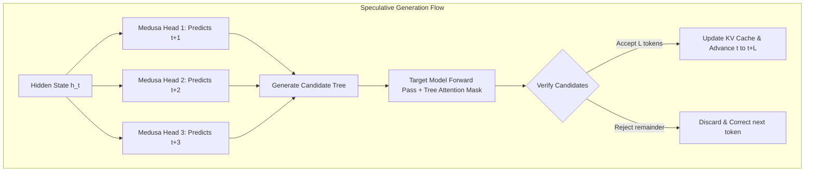
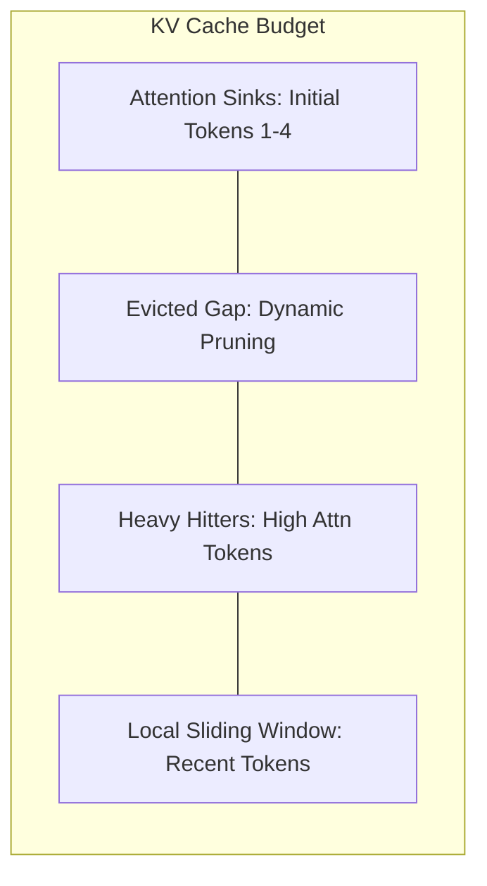
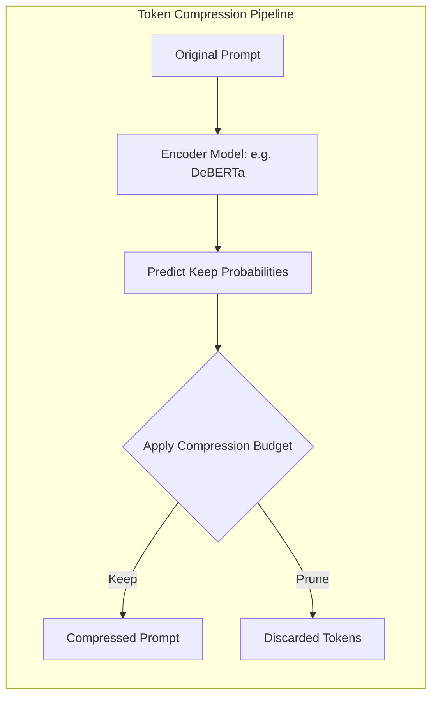
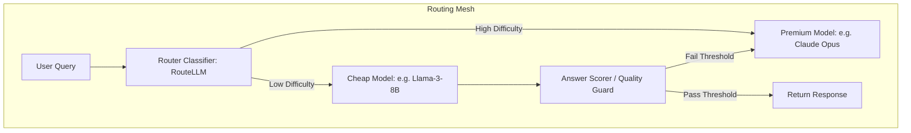

# LLM Data Processing & Inference Optimization: Academic Deep Dive
*Author: Elite AI Systems Architect*

This research report presents a technical deep dive into four advanced, enterprise-grade strategies for Large Language Model (LLM) data processing and inference optimization:
1. **Speculative Decoding with Candidate Drafting & Tree Attention Verification** (Medusa & EAGLE)
2. **Dynamic KV Cache Eviction & Attention Sinks** (H2O: Heavy-Hitter Oracle & StreamingLLM)
3. **Information-Entropy Prompt Token Compression** (LLMLingua & LLMLingua-2)
4. **Adaptive Model Routing Cascades & Preference-Based Routers** (FrugalGPT & RouteLLM)

---

## 1. Speculative Decoding with Candidate Drafting & Tree Attention Verification

### Technical Breakdown
Autoregressive decoding generates tokens sequentially, making inference bounded by GPU memory bandwidth rather than compute. Speculative decoding speeds this up by using a fast drafting mechanism to propose candidate continuations, which are then validated in parallel by the primary base model in a single forward pass.

*   **Standard Speculative Decoding (Leviathan et al. / Chen et al.):** Uses a separate, smaller draft model (e.g., Llama-3-8B to draft for Llama-3-70B). However, this introduces synchronization overhead, requires maintaining two active models in VRAM, and suffers when the draft and target models drift in token distributions.
*   **Medusa (arXiv:2401.10774):** Integrates multiple additional prediction heads (Medusa heads) directly onto the backbone model's last hidden state layer. Head $k$ is trained to predict the token at position $t + k + 1$ given the hidden state $h_t$. By bypassing a separate draft model, Medusa avoids draft-model synchronization latency.
*   **EAGLE (arXiv:2401.15077 / arXiv:2406.16858):** Performs speculation at the feature/hidden-state level rather than the token level. It trains a lightweight, single-layer transformer on the second-to-top layer hidden states of the base model. This allows it to capture sequence context better, making drafting significantly more accurate.
*   **Tree Attention Verification:** Instead of validating linear candidate sequences one-by-one, both Medusa and EAGLE arrange draft candidates in a tree structure. The target model verifies all candidate paths in the tree simultaneously. A custom **Tree-Structured Attention Mask** is used during self-attention: token $i$ is only permitted to attend to token $j$ if $j$ is an ancestor of $i$ in the draft tree.



### Mathematical & Conceptual Descriptions
Let $h_t$ be the hidden state outputted by the backbone LLM's top transformer layer at step $t$. The base model output head predicts the next token:
$$P^{(0)}(x_{t+1} | h_t) = \text{softmax}(W^{(0)} h_t)$$

Medusa appends $K$ linear/residual heads $W^{(1)}, W^{(2)}, \dots, W^{(K)}$. Head $k$ outputs predictions for position $t+k+1$:
$$P^{(k)}(x_{t+k+1} | h_t) = \text{softmax}(W^{(k)} h_t)$$

The generated candidates are constructed as paths in a tree. To verify the tree in a single model evaluation, the tree-structured attention mask $M \in \mathbb{R}^{N \times N}$ is formulated as:
$$M_{i,j} = \begin{cases} 0 & \text{if } j \in \text{Ancestors}(i) \\ -\infty & \text{otherwise} \end{cases}$$

For greedy verification, we accept draft token $x_{t+k}$ if:
$$x_{t+k} = \text{argmax}_{v} P^{(0)}(v | h_{t+k-1})$$

For temperature-based sampling, rejection sampling is used. A candidate token $x^*$ drafted by proposal distribution $q$ is accepted with probability:
$$\text{Pr}(\text{accept}) = \min\left(1, \frac{p(x^*)}{q(x^*)}\right)$$
where $p$ is the target model distribution.

### Latency / Cost Tradeoffs
*   **Latency:** Reduces latency by $2\times$ to $3.5\times$ in memory-bandwidth-limited scenarios (e.g., low concurrency / batch size = 1). Lossless inference ensures matching quality.
*   **Cost:** No extra model serving infrastructure is required (unlike dual-model setups). However, the draft tree increases the context length processed in the target model's forward pass, meaning that as batch size increases, the compute overhead of tree attention diminishes the memory-bandwidth savings.

### Python Code Sketch (Tree Attention Mask & Verification)
```python
import torch
import torch.nn as nn
import torch.nn.functional as F

class TreeAttentionVerifier:
    def __init__(self, draft_heads: int = 3):
        self.draft_heads = draft_heads

    @staticmethod
    def construct_tree_mask(parent_indices: list[int]) -> torch.Tensor:
        """
        Constructs a tree-structured 2D attention mask.
        parent_indices: List mapping each node index to its parent index in the candidate tree.
                        e.g., [0, 0, 1, 1, 2]
        """
        n = len(parent_indices)
        mask = torch.full((n, n), float("-inf"))
        
        # Build ancestor relations
        for child in range(n):
            mask[child, child] = 0.0  # Can always attend to self
            curr = parent_indices[child]
            while curr != child:
                mask[child, curr] = 0.0
                parent = parent_indices[curr]
                if parent == curr:  # Root reached
                    break
                curr = parent
        return mask

    def verify_candidates(
        self, 
        target_logits: torch.Tensor, 
        draft_tokens: torch.Tensor, 
        tree_paths: list[list[int]]
    ) -> tuple[list[int], int]:
        """
        Verifies draft tokens along candidate paths in parallel.
        target_logits: [tree_size, vocab_size] (logits from target model evaluation)
        draft_tokens: [tree_size] (tokens predicted by draft heads)
        tree_paths: List of paths (sequences of indices in the tree) to verify
        """
        # Greedy verification
        target_predictions = torch.argmax(target_logits, dim=-1)
        best_path = []
        max_accepted_len = 0
        
        for path in tree_paths:
            accepted_in_path = []
            for i, node_idx in enumerate(path):
                # For node_idx, the model predicts the next token. 
                # Compare target's prediction from previous step (or root) with the draft token
                expected_token = target_predictions[node_idx]
                if i + 1 < len(path):
                    next_node_idx = path[i + 1]
                    drafted_token = draft_tokens[next_node_idx]
                    if expected_token == drafted_token:
                        accepted_in_path.append(drafted_token.item())
                    else:
                        # Append the corrected token and stop path validation
                        accepted_in_path.append(expected_token.item())
                        break
                else:
                    # Last token in path, append target prediction
                    accepted_in_path.append(expected_token.item())
            
            if len(accepted_in_path) > max_accepted_len:
                max_accepted_len = len(accepted_in_path)
                best_path = accepted_in_path
                
        return best_path, max_accepted_len

# Verification Example
if __name__ == "__main__":
    verifier = TreeAttentionVerifier()
    # Tree representation:
    # 0 (root) -> 1 -> 3
    #          -> 2 -> 4
    parent_indices = [0, 0, 0, 1, 2]
    mask = verifier.construct_tree_mask(parent_indices)
    print("Tree Attention Mask (0.0 means attend, -inf means mask out):\n", mask)
```

---

## 2. Dynamic KV Cache Eviction & Attention Sinks

### Technical Breakdown
The Key-Value (KV) cache stores keys and values of past tokens to prevent redundant recalculation during autoregressive decoding. The size of the KV cache grows dynamically at $O(N)$ with sequence length $N$ and batch size $B$, creating a severe VRAM memory bottleneck.

*   **Attention Sinks (StreamingLLM - arXiv:2309.17453):** Discovered that LLMs assign disproportionately high attention scores to the first few tokens of a sequence (typically the first 2-4 tokens) regardless of their semantic importance. These tokens act as "sinks" because the softmax operation requires attention weights to sum to 1. If these sink tokens are evicted, the attention distribution collapses, leading to garbage outputs. Keeping the first $S$ tokens (sinks) + a sliding window of the latest $W$ tokens enables infinite length inference without performance collapse.
*   **Heavy-Hitter Oracle (H2O - arXiv:2306.14048):** Observes that at any point, only a sparse subset of historical tokens ("Heavy Hitters") receives the majority of attention weights. H2O dynamically calculates cumulative attention scores for each token and prunes/evicts the KV states of tokens that are not heavy-hitter candidates, while retaining the most recent tokens.



### Mathematical & Conceptual Descriptions
The attention weight matrix $\alpha$ at head $h$ is given by:
$$\alpha_{i,j}^{(h)} = \text{softmax}\left(\frac{Q_i^{(h)} (K_j^{(h)})^T}{\sqrt{d}}\right) = \frac{\exp\left(\frac{Q_i^{(h)} (K_j^{(h)})^T}{\sqrt{d}}\right)}{\sum_{m=1}^{t} \exp\left(\frac{Q_i^{(h)} (K_m^{(h)})^T}{\sqrt{d}}\right)}$$

In H2O, the importance score $I_j$ for token $j$ at step $t$ is computed dynamically:
$$I_j^{(t)} = I_j^{(t-1)} + \sum_{h=1}^{H} \alpha_{t,j}^{(h)}$$

Let $B$ be the VRAM KV cache budget. When cache size exceeds $B$, H2O evicts the KV cache values of token $j^*$ defined by:
$$j^* = \text{argmin}_{j \notin \{1..S\} \cup \{t-W..t\}} I_j^{(t)}$$
where $\{1..S\}$ is the set of protected attention sinks, and $\{t-W..t\}$ represents the sliding local context window.

### Latency / Cost Tradeoffs
*   **Latency:** By keeping KV cache size bounded at $B$, memory bandwidth pressure during decoding remains constant. This speeds up inference and avoids the high latency overhead of dynamic page allocations/swaps.
*   **Cost:** Substantially increases max serving concurrency (throughput). By capping the KV cache memory size, batch size can be scaled up to $5\times$ larger on a single GPU.
*   **Quality:** Pruning the mid-history tokens causes degradation in tasks requiring long-range global reasoning (e.g., retrieving details from arbitrary locations in books or logs, known as "needle in a haystack"). It is ideal for streaming conversational chats, summaries, or structured pipelines.

### Python Code Sketch (Eviction Strategy)
```python
import torch
import torch.nn as nn

class DynamicKVCache:
    def __init__(self, num_sinks: int = 4, max_cache_size: int = 16, window_size: int = 6):
        self.num_sinks = num_sinks
        self.max_cache_size = max_cache_size
        self.window_size = window_size
        self.importance_scores = None

    def prune_cache(
        self, 
        k_cache: torch.Tensor, 
        v_cache: torch.Tensor, 
        new_attn_weights: torch.Tensor
    ) -> tuple[torch.Tensor, torch.Tensor]:
        """
        k_cache: [batch, heads, seq_len, head_dim]
        v_cache: [batch, heads, seq_len, head_dim]
        new_attn_weights: [batch, heads, 1, seq_len] (latest token's attention distribution)
        """
        batch, heads, seq_len, head_dim = k_cache.shape
        if seq_len <= self.max_cache_size:
            return k_cache, v_cache

        # Initialize or update cumulative importance scores
        attn_sum = new_attn_weights.sum(dim=-2).mean(dim=0).mean(dim=0)  # average over batch/heads -> [seq_len]
        if self.importance_scores is None or self.importance_scores.shape[0] != seq_len:
            self.importance_scores = attn_sum
        else:
            self.importance_scores[:seq_len-1] += attn_sum[:-1]
            self.importance_scores = torch.cat([self.importance_scores[:-1], attn_sum[-1:]])

        # Define protected masks (Sinks + Window)
        protected_indices = torch.zeros(seq_len, dtype=torch.bool)
        protected_indices[:self.num_sinks] = True
        protected_indices[seq_len - self.window_size:] = True

        # Candidate indices for eviction (not protected)
        evict_candidates = torch.nonzero(~protected_indices).squeeze(-1)
        
        # Find index with minimum importance score among candidates
        candidate_scores = self.importance_scores[evict_candidates]
        min_candidate_idx = torch.argmin(candidate_scores)
        idx_to_evict = evict_candidates[min_candidate_idx].item()

        # Execute eviction
        keep_mask = torch.ones(seq_len, dtype=torch.bool)
        keep_mask[idx_to_evict] = False

        k_cache_pruned = k_cache[:, :, keep_mask, :]
        v_cache_pruned = v_cache[:, :, keep_mask, :]
        self.importance_scores = self.importance_scores[keep_mask]

        return k_cache_pruned, v_cache_pruned

# Instantiation & Testing
if __name__ == "__main__":
    cache_manager = DynamicKVCache(num_sinks=2, max_cache_size=8, window_size=3)
    k = torch.randn(1, 1, 9, 4)
    v = torch.randn(1, 1, 9, 4)
    attn = torch.rand(1, 1, 1, 9)  # New attention values
    
    k_pruned, v_pruned = cache_manager.prune_cache(k, v, attn)
    print("Pruned KV Cache Sequence Length:", k_pruned.shape[2])
```

---

## 3. Information-Entropy Prompt Token Compression

### Technical Breakdown
Prompts passed to LLMs often contain high semantic redundancy. Token compression algorithms filter out non-essential prompt text to minimize token overhead while retaining reasoning capabilities.

*   **LLMLingua (arXiv:2310.05736):** Utilizes a coarse-to-fine compression framework. It calculates the perplexity of sentences, phrases, and individual tokens using a small, local budget model (e.g., Llama-3-8B). Highly predictable segments (low perplexity) are discarded as they possess low self-information, while high perplexity segments are preserved.
*   **LLMLingua-2 (arXiv:2403.12968):** Frames prompt compression as a **Token Classification** task. Instead of executing multiple causal language model perplexity checks, it trains a small bi-directional Transformer encoder (e.g., DeBERTa) on data distilled from GPT-4 (which highlights kept/pruned tokens for generic tasks). It runs in linear time $O(N)$ with low overhead, generating binary keep/discard classifications per prompt token.



### Mathematical & Conceptual Descriptions
The information content (self-information) of token $x_i$ given its prefix context $x_{<i}$ is:
$$I(x_i | x_{<i}) = -\log P(x_i | x_{<i})$$

In LLMLingua, a budget controller allocates target compression ratios across different segments. For a segment $S = [x_1, \dots, x_M]$, we compute perplexity:
$$\text{PPL}(S) = \exp\left(-\frac{1}{M}\sum_{m=1}^{M} \log P(x_m | x_{<m})\right)$$

Under a target budget constraint representing token retention ratio $\beta \in (0, 1)$, we solve the binary extraction problem:
$$\max_{S'} \sum_{x \in S'} I(x | x_{<x}) \quad \text{s.t.} \quad |S'| \le \beta \cdot |S|$$

For LLMLingua-2, the classification model output $p_i = \sigma(W \cdot h_i)$ is evaluated, and the prompt is compressed by retaining tokens with $p_i \ge \theta$, where threshold $\theta$ is calibrated to meet budget $\beta$.

### Latency / Cost Tradeoffs
*   **Latency:** Adds local CPU/GPU computation latency to pre-process the prompt. However, because input token size is reduced (often by $2\times - 5\times$), the API's prefill phase is significantly faster.
*   **Cost:** Substantially reduces external API consumption costs (Input Token charges are reduced proportionally to $\beta$).
*   **Quality:** Mild drop in task accuracy depending on compression ratio. It performs best on context-heavy prompts (RAG, documentation retrieval) and worst on code generation or dense mathematical reasoning where syntax characters carry high critical entropy.

### Python Code Sketch (Entropy-Based Token Filter)
```python
import torch
import torch.nn as nn
import math
from transformers import AutoTokenizer, AutoModelForCausalLM

class EntropyCompressor:
    def __init__(self, model_name: str = "gpt2"):
        self.tokenizer = AutoTokenizer.from_pretrained(model_name)
        self.model = AutoModelForCausalLM.from_pretrained(model_name)
        self.model.eval()

    @torch.no_grad()
    def compress_prompt(self, prompt: str, target_ratio: float = 0.6) -> str:
        tokens = self.tokenizer(prompt, return_tensors="pt")
        input_ids = tokens["input_ids"]
        
        # Calculate loss (cross-entropy) for each token position
        outputs = self.model(input_ids, labels=input_ids)
        logits = outputs.logits # [1, seq_len, vocab_size]
        
        # Shift logits and inputs for conditional probability calculation
        shift_logits = logits[..., :-1, :].contiguous()
        shift_labels = input_ids[..., 1:].contiguous()
        
        # Compute individual cross-entropy losses per token
        loss_fn = nn.CrossEntropyLoss(reduction="none")
        token_losses = loss_fn(shift_logits.view(-1, shift_logits.size(-1)), shift_labels.view(-1))
        
        # Insert zero loss for first token (no prefix)
        token_losses = torch.cat([torch.tensor([0.0], device=token_losses.device), token_losses])
        
        # Pair tokens with their computed self-information (loss)
        token_info = []
        for idx, token_id in enumerate(input_ids[0]):
            token_text = self.tokenizer.decode([token_id])
            token_info.append({
                "idx": idx,
                "token_id": token_id.item(),
                "text": token_text,
                "entropy": token_losses[idx].item()
            })
            
        # Sort tokens by entropy (keep high entropy / high information)
        sorted_tokens = sorted(token_info, key=lambda x: x["entropy"], reverse=True)
        keep_count = int(math.ceil(len(token_info) * target_ratio))
        
        keep_indices = {tok["idx"] for tok in sorted_tokens[:keep_count]}
        keep_indices.add(0) # Ensure start token remains
        
        # Reconstruct sequence in original chronological order
        compressed_tokens = [tok["token_id"] for tok in token_info if tok["idx"] in keep_indices]
        return self.tokenizer.decode(compressed_tokens)

# Running local verification
if __name__ == "__main__":
    compressor = EntropyCompressor()
    text = "The quick brown fox jumps over the lazy dog, presenting an incredibly repetitive and redundant sequence of text."
    compressed = compressor.compress_prompt(text, target_ratio=0.7)
    print("Original Length:", len(text.split()))
    print("Compressed Prompt:", compressed)
```

---

## 4. Adaptive Model Routing Cascades & Preference-Based Routers

### Technical Breakdown
Not all incoming user queries require high-capacity, multi-billion parameter models (e.g., GPT-4 / Claude Opus). Adaptive model routing architectures direct queries to the cheapest model capable of meeting quality benchmarks, fallback-cascading to larger models only when confidence scores are low.

*   **FrugalGPT (arXiv:2305.05176):** Implements an LLM cascade. The query is evaluated sequentially. A cheap model runs first. An auxiliary "Answer Scorer" classifier evaluates the quality of the generated response. If the score is above threshold $\tau$, execution stops. If below, the query cascades to a premium model.
*   **RouteLLM (arXiv:2406.18665):** Trains a specialized routing model on human preference data (e.g., LMSYS Chatbot Arena pairwise comparison results). The router maps query text to embeddings and evaluates a lightweight neural classifier (MLP or matrix factorization) to dynamically route the query to either the "cheap" or "strong" model without running the cheap model first, eliminating duplicate inference latency.



### Mathematical & Conceptual Descriptions
Let $M_{\text{cheap}}$ and $M_{\text{strong}}$ be the target models with associated invocation costs $C_{\text{cheap}} \ll C_{\text{strong}}$.
The router is defined as a policy $\pi(x) \in [0, 1]$ parameterizing the probability of routing query $x$ to $M_{\text{strong}}$.

For RouteLLM, training optimizing preference data matches query embeddings $e(x)$ to human preferences. The router model $f_\theta(x)$ outputs probability score $p$:
$$p = \sigma(W \cdot e(x) + b)$$

The objective functions minimize expected cost under a constraint bounding quality degradation relative to the strong model:
$$\min_{\theta} \mathbb{E}_{x \sim \mathcal{D}} [C_{\pi(x)}] \quad \text{s.t.} \quad \mathbb{E}_{x \sim \mathcal{D}} [\text{Quality}(\pi(x))] \ge (1 - \epsilon) \mathbb{E}_{x \sim \mathcal{D}} [\text{Quality}(M_{\text{strong}})]$$
where cost is calculated as:
$$C_{\pi(x)} = (1 - \pi(x)) C_{\text{cheap}} + \pi(x) C_{\text{strong}}$$

In a cascading setup (FrugalGPT), the overall response is selected by scorer $g(x, y)$:
$$y = \begin{cases} M_{\text{cheap}}(x) & \text{if } g(x, M_{\text{cheap}}(x)) \ge \tau \\ M_{\text{strong}}(x) & \text{otherwise} \end{cases}$$

### Latency / Cost Tradeoffs
*   **Latency:** RouteLLM has low routing latency (adds only embedding extraction + MLP inference, $< 20\text{ms}$). FrugalGPT cascades suffer high latency penalties when the cheap model fails, as the query must be evaluated twice (cheap model + strong model).
*   **Cost:** Saves $50\% - 85\%$ of overall inference costs by resolving standard queries on lightweight models.
*   **Quality:** Achieves performance near-identical to running the strong model on $100\%$ of queries, depending on the calibration of the classifier thresholds.

### Python Code Sketch (Routing Classifier & Cascade)
```python
import numpy as np

class MockLLMClient:
    def __init__(self, name: str, cost_per_token: float):
        self.name = name
        self.cost = cost_per_token

    def generate(self, query: str) -> str:
        return f"Response from {self.name} for query: {query}"

class CascadeRouter:
    def __init__(
        self, 
        cheap_model: MockLLMClient, 
        strong_model: MockLLMClient, 
        routing_threshold: float = 0.65
    ):
        self.cheap = cheap_model
        self.strong = strong_model
        self.threshold = routing_threshold

    @staticmethod
    def get_query_complexity_features(query: str) -> float:
        """
        Extracts heuristic complexity features.
        In production, this is replaced by semantic embeddings passed to an MLP classifier.
        """
        words = query.lower().split()
        length = len(words)
        
        # Hard coding markers of reasoning/difficulty
        hard_words = ["explain", "solve", "prove", "optimize", "mathematical", "debug"]
        complexity_hits = sum(1 for w in words if w in hard_words)
        
        # Score calculation mapped between 0 and 1
        raw_score = (length * 0.02) + (complexity_hits * 0.25)
        return min(max(raw_score, 0.0), 1.0)

    def route_query(self, query: str) -> tuple[str, float, str]:
        complexity = self.get_query_complexity_features(query)
        
        # Check routing decision boundary
        if complexity < self.threshold:
            # Route to cheap model
            response = self.cheap.generate(query)
            cost = self.cheap.cost * len(query.split())
            routing_path = f"Router -> {self.cheap.name} (Complexity: {complexity:.2f})"
        else:
            # Route to strong model directly
            response = self.strong.generate(query)
            cost = self.strong.cost * len(query.split())
            routing_path = f"Router -> {self.strong.name} (Complexity: {complexity:.2f})"
            
        return response, cost, routing_path

# Demonstration execution
if __name__ == "__main__":
    cheap_client = MockLLMClient(name="Llama-3-8B", cost_per_token=0.00015)
    strong_client = MockLLMClient(name="GPT-4o", cost_per_token=0.005)
    
    router = CascadeRouter(cheap_client, strong_client, routing_threshold=0.5)
    
    # Run test cases
    query_1 = "Hi, what time is it?"
    query_2 = "Can you prove the correctness of Dijkstra's algorithm and optimize it?"
    
    res1, cost1, path1 = router.route_query(query_1)
    res2, cost2, path2 = router.route_query(query_2)
    
    print(f"Query 1: '{query_1}'\nPath: {path1}\nEstimated Cost: ${cost1:.6f}\n")
    print(f"Query 2: '{query_2}'\nPath: {path2}\nEstimated Cost: ${cost2:.6f}\n")
```

---

## 5. Comparative Tradeoff Matrix

| Optimization Strategy | Target Resource Saved | Tradeoff / Cost Incurred | Downstream Quality Impact | Best Suited For |
| :--- | :--- | :--- | :--- | :--- |
| **Speculative Decoding** | Decoding Latency ($2\text{x}-3.5\text{x}$) | Extra GPU VRAM for draft heads; high compilation overhead. | **Lossless** (identical to baseline target distributions). | Interactive real-time generations, local LLM deployments. |
| **KV Cache Eviction** | VRAM Memory footprint | Computational overhead tracking importance scores dynamically. | **Degraded** long-range retrieval context accuracy. | Chat applications, continuous document summarization. |
| **Prompt Token Compression** | Input Token API cost ($2\text{x}-5\text{x}$) | Local GPU/CPU usage for preprocessing (run compression model). | **Minor drop** in formatting and syntax-heavy operations. | RAG applications with extensive context windows. |
| **Model Routing Cascades** | Output Inference cost ($50\%-85\%$) | Routing latency; fallback loops double generation latency. | **Minor drop** in performance depending on classification boundary. | High-throughput multi-domain enterprise applications. |
