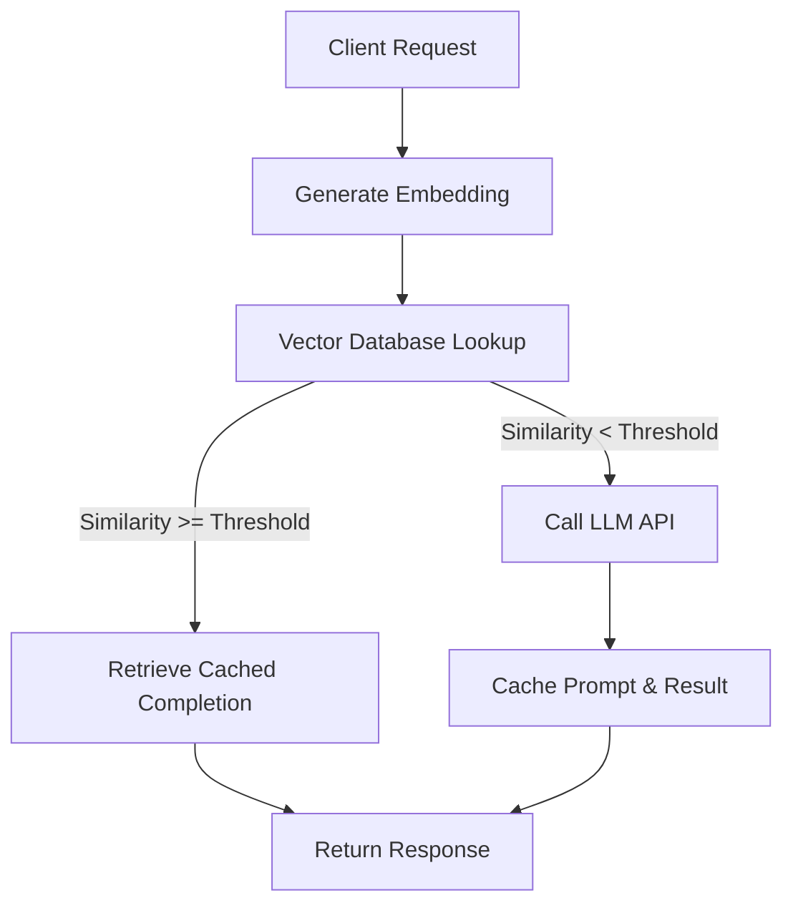
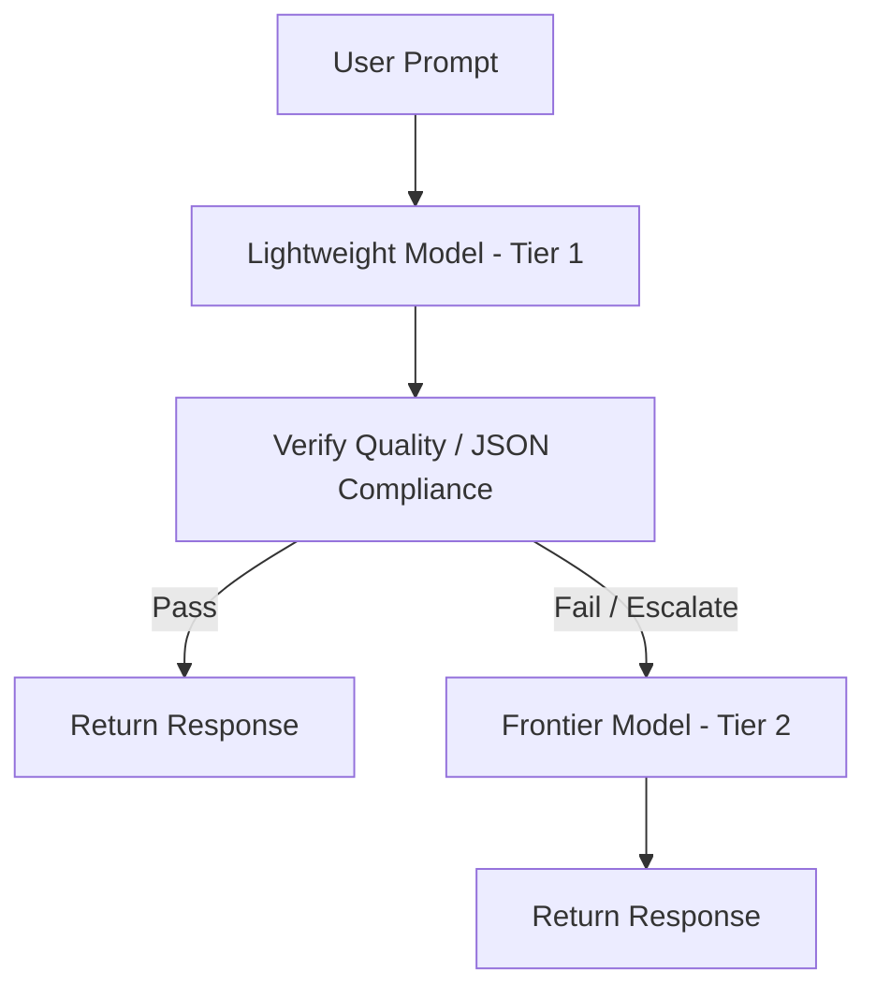
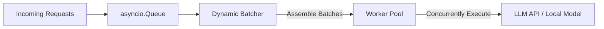
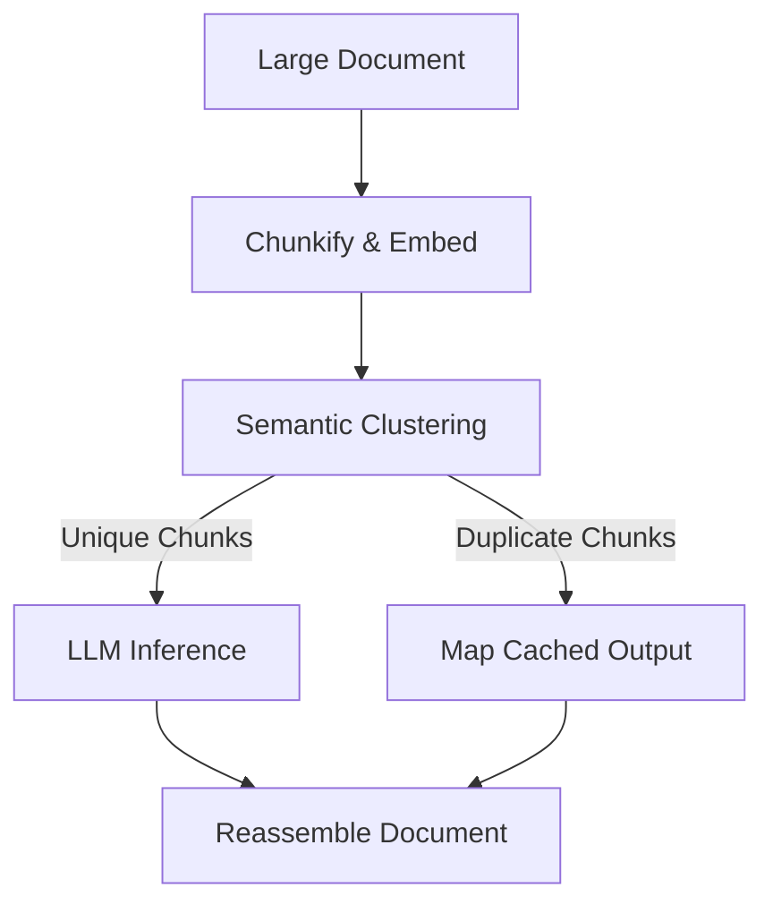

# Enterprise LLM Scaling and Optimization Strategies
*A Research Report on Architectural Patterns for High-Throughput, Cost-Effective LLM Integration*

---

## Executive Summary
This report details four core architectural strategies employed by leading technology firms (such as Uber, Stripe, Netflix, and Airbnb) to optimize enterprise-grade LLM pipelines. These patterns focus on high-throughput ingestion, cost mitigation, scheduling stability, and semantic pre-processing.

---

### Strategy 1: Semantic Caching for Intent-Based Query Bypass
#### 1. Concept and Flow
A Semantic Cache intercepts incoming natural language prompts and evaluates them against previously processed and stored queries using vector similarity. Instead of exact string match caching (which has a near-zero hit rate in LLM applications), it determines the semantic equivalence of queries.



#### 2. Target Use Cases
- Customer support chatbots answering common inquiries.
- Retrieval-Augmented Generation (RAG) search agents.
- Automated code formatting and static analysis assistants.

#### 3. Latency & Cost Tradeoffs
- **Latency (Hit)**: Drops from `~1500ms - 5000ms` (LLM inference) to `~15ms - 50ms` (embedding + vector search).
- **Latency (Miss)**: Adds a penalty of `~40ms - 80ms` (additional embedding call and vector database round-trip).
- **Cost**: A cache hit consumes `0 tokens` from the generation LLM, replacing it with a minor embedding cost (typically ~$0.00002 / 1K tokens) and vector search query costs. A `25%` cache hit rate in production typically reduces overall LLM api billing by `~22%`.

> [!TIP]
> Use tiered similarity thresholds (e.g., $\ge 0.95$ for sensitive/factual tasks and $\ge 0.82$ for creative/conversational intents) to maximize cache hit rates without compromising safety.

#### 4. Python Code Sketch
```python
import numpy as np
from typing import Dict, Tuple, Optional

class SemanticCache:
    def __init__(self, threshold: float = 0.90):
        self.threshold = threshold
        # In production, this would be a Vector DB (e.g., Redis VL, Pinecone, Milvus)
        self.cache_keys: list[np.ndarray] = []
        self.cache_values: list[dict] = []

    def _cosine_similarity(self, a: np.ndarray, b: np.ndarray) -> float:
        dot_product = np.dot(a, b)
        norm_a = np.linalg.norm(a)
        norm_b = np.linalg.norm(b)
        if norm_a == 0 or norm_b == 0:
            return 0.0
        return float(dot_product / (norm_a * norm_b))

    def get(self, query_embedding: np.ndarray) -> Optional[Tuple[str, float]]:
        """
        Lookup query embedding in cached keys. Returns (response, similarity) if hit.
        """
        if not self.cache_keys:
            return None
        
        # Calculate similarities across all cached vectors
        similarities = [self._cosine_similarity(query_embedding, cached) for cached in self.cache_keys]
        max_idx = int(np.argmax(similarities))
        max_sim = similarities[max_idx]
        
        if max_sim >= self.threshold:
            return self.cache_values[max_idx]["response"], max_sim
        return None

    def set(self, query_embedding: np.ndarray, response: str):
        """
        Store query embedding and response in the cache.
        """
        self.cache_keys.append(query_embedding)
        self.cache_values.append({"response": response})

# Mock Testing Script
if __name__ == "__main__":
    cache = SemanticCache(threshold=0.88)
    
    # Simulating embedding vectors of size 1536 (typical OpenAI size)
    np.random.seed(42)
    mock_base = np.random.randn(1536)
    mock_base /= np.linalg.norm(mock_base)
    
    # Cache a mock prompt response
    cache.set(mock_base, "The database is currently running version 16.2 of PostgreSQL.")
    
    # Query with a nearly identical vector (slight perturbation)
    mock_noise = np.random.randn(1536)
    mock_noise /= np.linalg.norm(mock_noise)
    mock_query_near = mock_base + mock_noise * 0.15
    mock_query_near /= np.linalg.norm(mock_query_near)
    
    # Query with a completely different vector
    mock_query_far = np.random.randn(1536)
    mock_query_far /= np.linalg.norm(mock_query_far)
    
    print("Query 1 (Similar):", cache.get(mock_query_near))
    print("Query 2 (Different):", cache.get(mock_query_far))
```

---

### Strategy 2: Multi-Tier Model Cascades and Evaluation Routers
#### 1. Concept and Flow
This strategy scales requests by executing a cascading sequence of LLMs (Tier 1 -> Tier 2 -> Tier 3), evaluating the output at each stage. Simple, high-frequency queries are handled by inexpensive, lightweight models. If the evaluation layer flags the output as low quality, incomplete, or corrupted, the request escalates to a frontier, high-reasoning model.



#### 2. Target Use Cases
- Complex multi-step agent actions.
- Code generation gateways.
- High-volume document summarization/translation with strict validation constraints.

#### 3. Latency & Cost Tradeoffs
- **Latency**: Cascaded execution increases tail latency (p99) when escalation occurs (since both Tier 1 and Tier 2 models must execute sequentially).
- **Cost**: Saves up to `70%` in API fees by resolving the majority of tasks on Tier 1 (e.g., 85% of queries solved via a cheap model costing $0.15/1M tokens vs. $15.00/1M tokens for Tier 2).

> [!IMPORTANT]
> The evaluator must be extremely fast (e.g., regex checks, simple parser, or an ultra-small classifier) to ensure the latency overhead is minimized for Tier 1 passes.

#### 4. Python Code Sketch
```python
import asyncio
import json
from typing import Dict, Any, Callable

# Simple simulated model clients
async def call_tier_1_model(prompt: str) -> str:
    # Simulating a cheap model (e.g., gpt-4o-mini)
    # Sometimes it fails to output correct JSON
    await asyncio.sleep(0.1)
    if "fail_json" in prompt:
        return '{"status": "processing", "code": 102'  # Malformed JSON
    return '{"status": "success", "data": "Handled by Tier 1"}'

async def call_tier_2_model(prompt: str) -> str:
    # Simulating a smart model (e.g., gpt-4o or claude-3-5-sonnet)
    await asyncio.sleep(0.8)
    return '{"status": "success", "data": "Resolved by Tier 2 Frontier Model"}'

class CascadeRouter:
    def __init__(self, evaluator: Callable[[str], bool]):
        self.evaluator = evaluator

    async def execute(self, prompt: str) -> Dict[str, Any]:
        # Tier 1 Attempt
        print(">> Dispatching to Tier 1 Model...")
        tier_1_output = await call_tier_1_model(prompt)
        
        if self.evaluator(tier_1_output):
            print("✓ Tier 1 Passed Evaluation.")
            return {"source": "Tier 1", "output": json.loads(tier_1_output)}
            
        print("⚠ Tier 1 Failed Evaluation. Escalating to Tier 2...")
        tier_2_output = await call_tier_2_model(prompt)
        return {"source": "Tier 2", "output": json.loads(tier_2_output)}

# Evaluator checks if string is valid JSON
def is_valid_json(output: str) -> bool:
    try:
        json.loads(output)
        return True
    except json.JSONDecodeError:
        return False

# Mock Execution
async def main():
    router = CascadeRouter(evaluator=is_valid_json)
    
    print("\n--- Test Case 1: Simple Success ---")
    res1 = await router.execute("Get user statistics.")
    print("Result:", res1)
    
    print("\n--- Test Case 2: Malformed Output Forcing Escalation ---")
    res2 = await router.execute("Get user statistics and fail_json.")
    print("Result:", res2)

if __name__ == "__main__":
    asyncio.run(main())
```

---

### Strategy 3: Dynamic Batching and Rate-Limited Worker Pools
#### 1. Concept and Flow
To prevent rate-limit exhaustion (429 errors) and maximize GPU utilization on private clusters, this strategy uses a thread-safe Queue to buffer incoming requests. A scheduling worker collects these tasks and dynamically batches them either up to a maximum batch size or until a wait-window expires. These batches are then distributed to a worker pool that controls concurrency.



#### 2. Target Use Cases
- High-throughput ingestion of files (e.g., DOCX/PDF translation pipelines).
- Large-scale offline data enrichment (e.g., product tagging, sentiment labeling).

#### 3. Latency & Cost Tradeoffs
- **Latency**: Introduces a minor batching latency (e.g., `50ms` wait time) to accumulate requests. However, it ensures system stability by smoothing spike loads and eliminating retry loops.
- **Cost**: Reduces API cost by up to `50%` using model provider batch endpoints (e.g., OpenAI Batch API). For self-hosted infrastructure, dynamic batching can boost GPU throughput by `3x - 10x` compared to serial execution.

> [!WARNING]
> Dynamic batching requires robust monitoring of wait windows. If set too high, user-interactive queries will suffer from excessive latency.

#### 4. Python Code Sketch
```python
import asyncio
import time
from typing import List, Dict, Any

class DynamicBatcher:
    def __init__(self, max_batch_size: int = 4, max_wait_sec: float = 0.2):
        self.max_batch_size = max_batch_size
        self.max_wait_sec = max_wait_sec
        self.queue: asyncio.Queue = asyncio.Queue()

    async def add_request(self, item: Dict[str, Any]) -> asyncio.Future:
        future = asyncio.get_event_loop().create_future()
        await self.queue.put((item, future))
        return future

    async def start_processing(self):
        while True:
            batch = []
            futures = []
            start_time = time.time()

            # Wait for at least one item
            first_item, first_future = await self.queue.get()
            batch.append(first_item)
            futures.append(first_future)

            # Attempt to fill the rest of the batch up to max_wait_sec
            while len(batch) < self.max_batch_size:
                time_left = self.max_wait_sec - (time.time() - start_time)
                if time_left <= 0:
                    break
                try:
                    item, future = await asyncio.wait_for(self.queue.get(), timeout=time_left)
                    batch.append(item)
                    futures.append(future)
                except asyncio.TimeoutError:
                    break

            # Execute batch
            print(f"[Batcher] Dispatching batch of size {len(batch)} to worker...")
            asyncio.create_task(self._execute_batch(batch, futures))

    async def _execute_batch(self, batch: List[Dict[str, Any]], futures: List[asyncio.Future]):
        # Simulating batch inference (e.g., dynamic model batching)
        await asyncio.sleep(0.3)
        for i, item in enumerate(batch):
            result = {"id": item["id"], "output": f"Processed: {item['text']}"}
            futures[i].set_result(result)

# Mock Runner
async def runner():
    batcher = DynamicBatcher(max_batch_size=3, max_wait_sec=0.1)
    asyncio.create_task(batcher.start_processing())

    # Add mock requests in quick succession
    f1 = await batcher.add_request({"id": 1, "text": "Task A"})
    f2 = await batcher.add_request({"id": 2, "text": "Task B"})
    await asyncio.sleep(0.02) # Very short delay
    f3 = await batcher.add_request({"id": 3, "text": "Task C"})
    f4 = await batcher.add_request({"id": 4, "text": "Task D"})

    results = await asyncio.gather(f1, f2, f3, f4)
    print("Completed Jobs Status:", results)

if __name__ == "__main__":
    asyncio.run(runner())
```

---

### Strategy 4: Semantic Deduplication and Chunk Fan-Out
#### 1. Concept and Flow
When processing very large documents or multi-document corpuses (such as Bavl's translation jobs), there is significant structural boilerplate and repetitive text. This pipeline chunkifies the input, computes chunk embeddings, and clusters duplicate/near-duplicate blocks. It sends only a single representative chunk from each cluster to the LLM and maps the generated output back to all duplicates before final document assembly.



#### 2. Target Use Cases
- Bulk translation of user manuals, financial sheets, or legal documents.
- Scraping and summarizing large, template-heavy web datasets.

#### 3. Latency & Cost Tradeoffs
- **Latency**: Adds pre-processing clustering time (~100-300ms) but reduces overall execution time dramatically by reducing the total number of parallel LLM calls.
- **Cost**: Decreases token consumption by `30% - 80%` depending on document repetitiveness, resulting in major cost reductions.

> [!CAUTION]
> If similarity thresholds for deduplication are set too low, distinct segments with similar phrasing may be mapped to the wrong translations, leading to data corruption.

#### 4. Python Code Sketch
```python
from typing import List, Dict
import numpy as np

class SemanticDeduplicator:
    def __init__(self, threshold: float = 0.95):
        self.threshold = threshold

    def _cosine_similarity(self, a: np.ndarray, b: np.ndarray) -> float:
        dot_val = np.dot(a, b)
        return float(dot_val / (np.linalg.norm(a) * np.linalg.norm(b)))

    def process(self, chunks: List[str], embeddings: List[np.ndarray]) -> List[str]:
        """
        Deduplicates chunks based on embedding similarity, executes processing,
        and reassembles results.
        """
        unique_indices = []
        # Mapping from index in 'chunks' list to index in 'unique_indices' list
        mapping = {}

        for idx, emb in enumerate(embeddings):
            match_found = False
            for u_idx in unique_indices:
                if self._cosine_similarity(emb, embeddings[u_idx]) >= self.threshold:
                    mapping[idx] = u_idx
                    match_found = True
                    break
            if not match_found:
                unique_indices.append(idx)
                mapping[idx] = idx

        print(f"Total chunks: {len(chunks)} | Unique chunks to process: {len(unique_indices)}")

        # Execute mock LLM logic only on unique chunks
        processed_unique_cache = {}
        for u_idx in unique_indices:
            # Simulate LLM call
            processed_unique_cache[u_idx] = f"PROCESSED_LLM({chunks[u_idx]})"

        # Reassemble original list using mapping
        output = []
        for idx in range(len(chunks)):
            target_unique_idx = mapping[idx]
            output.append(processed_unique_cache[target_unique_idx])

        return output

# Mock execution
if __name__ == "__main__":
    dedup = SemanticDeduplicator(threshold=0.92)
    
    mock_chunks = [
        "Welcome to Gently Ventures", 
        "Copyright Gently Ventures LLC 2026", 
        "Welcome to Gently Ventures!!", # semantic duplicate
        "Our core product is highly scalable."
    ]
    
    # 3-dimensional mock embeddings
    mock_embeddings = [
        np.array([1.0, 0.0, 0.0]),
        np.array([0.0, 1.0, 0.0]),
        np.array([0.98, 0.05, 0.01]), # Very close to chunk 0
        np.array([0.0, 0.0, 1.0])
    ]
    
    results = dedup.process(mock_chunks, mock_embeddings)
    print("Reassembled Results:")
    for chunk, res in zip(mock_chunks, results):
        print(f"Original: {chunk} -> Result: {res}")
```
