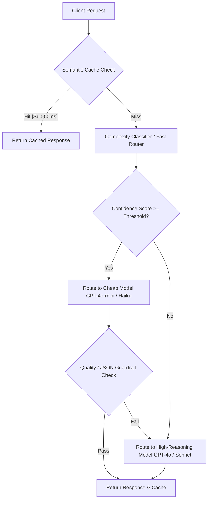
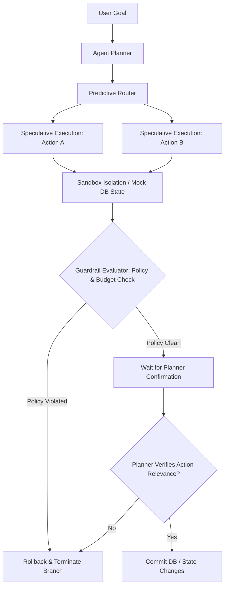
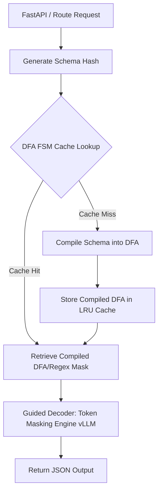
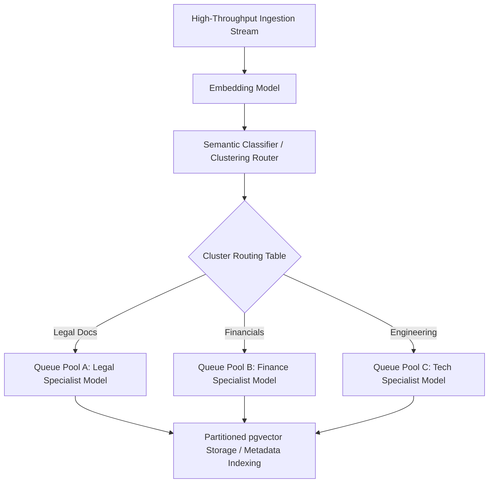

# Advanced Enterprise LLM Routing & Optimization Architectures
*Research Report on Production-Grade LLM Systems*

This document investigates advanced enterprise-grade LLM data processing strategies, engineering optimization patterns, and architectural designs used by scale-up engineering teams (e.g., Stripe, Uber, Airbnb, Vercel, Supabase).

---

## 1. LLM-Mesh Dynamic Cascade & Fallback Routing
### Concept & Flow
A dynamic cascade router implements an intelligent gateway that sits between client applications and model providers. Rather than sending all requests to a high-capacity, expensive frontier model (e.g., GPT-4o, Claude 3.5 Sonnet), requests are routed sequentially based on complexity classification, semantic cache lookups, and real-time response quality evaluations.



### Use Case
Multi-tenant customer support portals, dynamic classification tasks, database query generation, and localized language translation pipelines where query difficulty has high variance.

### Latency / Cost Tradeoffs
*   **Latency**: Introduces a minor overhead for the router classifier (15-30ms) and semantic cache lookup (10-25ms). If the cheap model fails guardrails and falls back to the expensive model, total latency increases by the duration of the first model run.
*   **Cost**: Reduces overall API expenditure by 60% to 85% by successfully handling up to 80% of queries on sub-$1.00/M token models.

### Python Code Sketch

```python
import time
import json
import numpy as np
from typing import Dict, Any, Tuple

# Mock client for simulating OpenAI/Anthropic calls
class MockLLMClient:
    def call_model(self, model: str, prompt: str) -> Tuple[str, float]:
        """Simulates LLM invocation, returning response and self-reported confidence."""
        time.sleep(0.1 if "mini" in model or "haiku" in model else 0.5)
        if "mini" in model or "haiku" in model:
            # Simple tasks pass, complex queries return low confidence
            if len(prompt) > 80 or "explain" in prompt.lower():
                return "Here is a basic answer...", 0.65
            return "Simple resolution response.", 0.95
        else:
            return "Deep reasoning analysis and comprehensive answer.", 0.99

class CascadeRouter:
    def __init__(self, fallback_threshold: float = 0.85):
        self.client = MockLLMClient()
        self.threshold = fallback_threshold
        # Simple semantic cache mock (key -> response)
        self.semantic_cache: Dict[str, str] = {
            "hello": "Hi there! How can I help you today?",
            "ping": "pong"
        }
        
    def _is_cache_hit(self, prompt: str) -> Tuple[bool, str]:
        # Vector search / cosine similarity mockup
        normalized = prompt.strip().lower()
        if normalized in self.semantic_cache:
            return True, self.semantic_cache[normalized]
        return False, ""

    def process_request(self, prompt: str) -> Dict[str, Any]:
        start_time = time.time()
        
        # 1. Semantic Cache Layer
        hit, cached_val = self._is_cache_hit(prompt)
        if hit:
            return {
                "response": cached_val,
                "route": "semantic_cache",
                "latency_ms": (time.time() - start_time) * 1000,
                "cost": 0.0
            }
            
        # 2. Classifier / Direct Cascade Layer
        # Lightweight heuristic: evaluate complexity of query
        is_complex = len(prompt) > 80 or any(word in prompt.lower() for word in ["optimize", "architect", "debug"])
        
        if not is_complex:
            # Route to cheap tier
            model = "gpt-4o-mini"
            cost_multiplier = 0.05  # $0.15 / 1M tokens
            resp, confidence = self.client.call_model(model, prompt)
            
            # Verify if response meets confidence threshold
            if confidence >= self.threshold:
                return {
                    "response": resp,
                    "route": f"cheap_tier ({model})",
                    "latency_ms": (time.time() - start_time) * 1000,
                    "cost": cost_multiplier * 0.1
                }
            print(f"[Warning] Cheap model confidence {confidence} below threshold {self.threshold}. Falling back...")
            
        # 3. Fallback / High-Reasoning Tier
        model = "gpt-4o"
        cost_multiplier = 1.0  # $5.00 / 1M tokens
        resp, confidence = self.client.call_model(model, prompt)
        return {
            "response": resp,
            "route": f"high_reasoning_tier ({model})",
            "latency_ms": (time.time() - start_time) * 1000,
            "cost": cost_multiplier * 0.1
        }

# Execution Demonstration
if __name__ == "__main__":
    router = CascadeRouter(fallback_threshold=0.80)
    
    # Test case 1: Cache hit
    print(router.process_request("hello"))
    # Test case 2: Simple query (cheap model handles it)
    print(router.process_request("What is 2+2?"))
    # Test case 3: Complex query (forces fallback / high-reasoning model)
    print(router.process_request("Can you optimize this custom sorting algorithm and architect a database mapping?"))
```

---

## 2. Guardrail-Aligned Speculative Agentic Execution
### Concept & Flow
In agentic workflows, execution pipelines are often bottle-necked by sequential reasoning steps and external API verification. Under Speculative Agentic Execution, the system predicts the most likely next $N$ actions (e.g., fetching a user record and querying database transactions) and executes them in parallel inside a sandbox transaction before the preceding steps have completed. Guardrails continuously monitor the transaction context. If the final plan aligns with the speculative branch and passes safety filters, the transaction is committed; otherwise, it is silently rolled back.



### Use Case
Complex workflow tools like Stripe invoices generation, Uber route calculations, or automated codebase refactoring pipelines where operations can be pre-computed speculatively.

### Latency / Cost Tradeoffs
*   **Latency**: Saves 300ms to 800ms per step by executing predicted steps in parallel rather than blocking on each agent prompt loop.
*   **Cost**: Increases token and computing cost (up to 20-30%) when speculative paths are rejected and rolled-back.

### Python Code Sketch

```python
import asyncio
from typing import Dict, Any, List

class DatabaseSandbox:
    def __init__(self):
        self.state = {"credits": 100, "status": "active"}
        self.journal: List[Dict[str, Any]] = []

    def speculative_write(self, key: str, val: Any):
        self.journal.append({"action": "write", "key": key, "old_val": self.state.get(key), "new_val": val})
        self.state[key] = val

    def commit(self):
        self.journal.clear()

    def rollback(self):
        for op in reversed(self.journal):
            if op["action"] == "write":
                self.state[op["key"]] = op["old_val"]
        self.journal.clear()

class GuardrailEngine:
    def validate_action(self, action: str, params: Dict[str, Any], state: Dict[str, Any]) -> bool:
        # Prevent runaway credits exhaustion and status mutation policies
        if action == "deduct_credits" and params.get("amount", 0) > state.get("credits", 0):
            return False
        if action == "delete_account":
            return False  # Strict administrative policy violation
        return True

async def run_speculative_action(sandbox: DatabaseSandbox, action: str, params: Dict[str, Any]) -> Dict[str, Any]:
    # Simulate async action processing
    await asyncio.sleep(0.05)
    if action == "deduct_credits":
        sandbox.speculative_write("credits", sandbox.state["credits"] - params["amount"])
        return {"status": "success", "deducted": params["amount"]}
    return {"status": "skipped"}

async def execute_agent_step():
    sandbox = DatabaseSandbox()
    guardrail = GuardrailEngine()
    
    # Speculative branch: Agent guesses it needs to deduct credits
    speculative_action = "deduct_credits"
    speculative_params = {"amount": 20}
    
    print(f"Initial State: {sandbox.state}")
    
    # 1. Speculatively execute in isolated sandbox
    result = await run_speculative_action(sandbox, speculative_action, speculative_params)
    print(f"Speculative State (Before Commit): {sandbox.state}")
    
    # 2. Run Guardrail validation over sandbox context
    is_safe = guardrail.validate_action(speculative_action, speculative_params, sandbox.state)
    
    # 3. Simulate Planner validation check
    planner_confirmed = True  # Agent plan matches speculation
    
    if is_safe and planner_confirmed:
        sandbox.commit()
        print(f"State Committed successfully: {sandbox.state}")
    else:
        sandbox.rollback()
        print(f"State Rolled back: {sandbox.state}")

if __name__ == "__main__":
    asyncio.run(execute_agent_step())
```

---

## 3. Schema-Compilation Caching Pipelines
### Concept & Flow
Generating structured JSON outputs from LLMs requires constraining the output at the token generation level using a Deterministic Finite Automaton (DFA) or Context-Free Grammar (CFG). Compiling a complex JSON schema (like a multi-nested Pydantic model) into a DFA can take 300ms to 2000ms. In high-throughput settings, this schema compilation is cached by hashing the schema dictionary to check against a fast in-memory LRU cache, bypassing the compilation phase for recurring schemas.



### Use Case
Vercel serverless functions executing structured data extraction, Supabase edge functions, or high-throughput JSON generation pipelines.

### Latency / Cost Tradeoffs
*   **Latency**: Reduces structural validation pre-processing from 500ms+ to less than 1ms (sub-millisecond latency on cache hit).
*   **Memory**: High RAM usage to store heavy compiled DFA objects in worker memory.

### Python Code Sketch

```python
import hashlib
import json
import time
from collections import OrderedDict

# Simulated DFA compiler (like outlines or xgrammar)
class DFACompiler:
    def compile_schema_to_dfa(self, schema: dict) -> str:
        """Simulates heavy CPU-bound parsing of schema to construct a DFA state machine."""
        time.sleep(0.4) # Simulate 400ms compilation overhead
        # Mock compilation product (state transition representation)
        return f"DFA_STATE_MACHINE_FOR_{len(schema.keys())}_KEYS"

class SchemaDFACache:
    def __init__(self, max_size: int = 128):
        self.compiler = DFACompiler()
        self.cache: OrderedDict[str, str] = OrderedDict()
        self.max_size = max_size

    def _get_schema_hash(self, schema: dict) -> str:
        # Deterministic serialization to handle key ordering issues
        serialized = json.dumps(schema, sort_keys=True)
        return hashlib.sha256(serialized.encode('utf-8')).hexdigest()

    def get_compiled_dfa(self, schema: dict) -> str:
        schema_hash = self._get_schema_hash(schema)
        
        if schema_hash in self.cache:
            # Hit: Move to end for LRU policy
            self.cache.move_to_end(schema_hash)
            return self.cache[schema_hash]
            
        # Miss: Compile and store
        compiled_dfa = self.compiler.compile_schema_to_dfa(schema)
        self.cache[schema_hash] = compiled_dfa
        
        if len(self.cache) > self.max_size:
            self.cache.popitem(last=False) # Evict oldest
            
        return compiled_dfa

# Verification Execution
if __name__ == "__main__":
    cache = SchemaDFACache(max_size=2)
    user_schema = {
        "type": "object",
        "properties": {
            "name": {"type": "string"},
            "age": {"type": "integer"}
        },
        "required": ["name", "age"]
    }
    
    # First request: Compilation Miss
    t0 = time.time()
    dfa_1 = cache.get_compiled_dfa(user_schema)
    t1 = time.time()
    print(f"Compilation Cache Miss - DFA: {dfa_1}, Time: {(t1 - t0)*1000:.2f}ms")

    # Second request: Cache Hit
    t2 = time.time()
    dfa_2 = cache.get_compiled_dfa(user_schema)
    t3 = time.time()
    print(f"Compilation Cache Hit - DFA: {dfa_2}, Time: {(t3 - t2)*1000:.2f}ms")
```

---

## 4. Semantic Partitioning & Fan-Out Ingestion
### Concept & Flow
For large-scale data ingestion (e.g., thousands of documents or audit logs), standard single-model workflows suffer from token-limit bottlenecks and context window degradation. Semantic Partitioning uses a fast embedding model to group documents into distinct thematic clusters. The system then fans out ingestion to dedicated, isolated worker pools running task queues (e.g., Celery/Redis) with custom vector partitions and specialized prompt templates.



### Use Case
Enterprise document processing engines (e.g., Stripe corporate filings ingestion, Airbnb tax documentation intake, Supabase custom pgvector data partitioners).

### Latency / Cost Tradeoffs
*   **Latency**: Minimizes total job time through massive parallel fan-out across specialized node pools.
*   **Cost**: Drastically reduces input token footprint (costs) by preventing large context sizes from hitting expensive multi-modal models simultaneously.

### Python Code Sketch

```python
import numpy as np
from typing import List, Dict, Any

class SemanticPartitionRouter:
    def __init__(self):
        # Mock centroids for "Finance", "Tech", "Legal"
        self.centroids = {
            "finance": np.array([0.9, 0.1, 0.0]),
            "tech": np.array([0.1, 0.9, 0.0]),
            "legal": np.array([0.0, 0.1, 0.9])
        }
        
    def _get_mock_embedding(self, content: str) -> np.ndarray:
        content_lower = content.lower()
        if "invoice" in content_lower or "tax" in content_lower or "revenue" in content_lower:
            return np.array([0.85, 0.15, 0.0])
        elif "kubernetes" in content_lower or "database" in content_lower or "schema" in content_lower:
            return np.array([0.05, 0.90, 0.05])
        else:
            return np.array([0.1, 0.1, 0.8]) # Legal fallback representation

    def route_document(self, content: str) -> str:
        emb = self._get_mock_embedding(content)
        
        # Calculate cosine similarity or Euclidean distance to partition centroids
        best_partition = "default"
        best_score = -1.0
        
        for name, centroid in self.centroids.items():
            # Standard Cosine Similarity formula: dot(A, B) / (norm(A)*norm(B))
            score = np.dot(emb, centroid) / (np.linalg.norm(emb) * np.linalg.norm(centroid))
            if score > best_score:
                best_score = score
                best_partition = name
                
        return best_partition

class WorkerQueuePool:
    def __init__(self):
        self.queues: Dict[str, List[str]] = {"finance": [], "tech": [], "legal": []}

    def dispatch(self, partition: str, content: str):
        self.queues[partition].append(content)
        print(f"[Queue Dispatch] Routed document chunk to specialized queue: '{partition}' (Queue Size: {len(self.queues[partition])})")

# Ingestion Loop Simulation
if __name__ == "__main__":
    router = SemanticPartitionRouter()
    queue_pool = WorkerQueuePool()
    
    documents = [
        "Invoice INV-2026: Stripe Payment processing fees and corporate revenue tax.",
        "System Architecture: Deploying Supabase with pgvector partitions on Kubernetes.",
        "Terms of Service & Licensing: Compliance with state laws and GDPR regulations."
    ]
    
    for doc in documents:
        target_partition = router.route_document(doc)
        queue_pool.dispatch(target_partition, doc)
```
