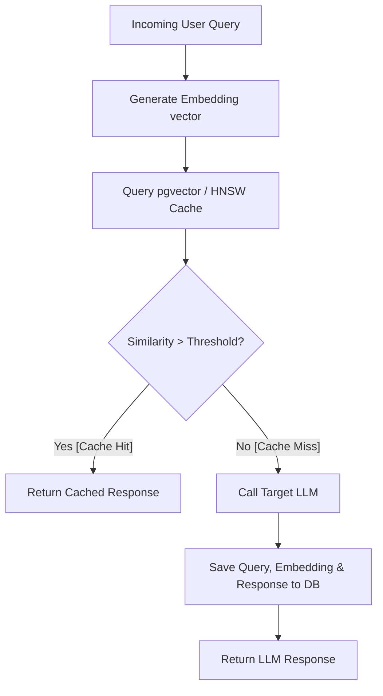
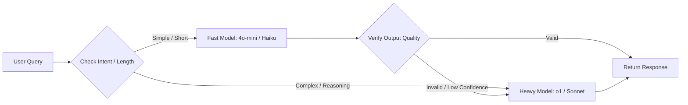

# Enterprise LLM Data Processing Strategy & Optimization Patterns
*A forensic analysis of high-throughput ingestion, cost mitigation, parallel scheduling, routing cascades, and semantic preprocessing patterns.*

---

## Executive Summary
As LLMs migrate from experimental chat interfaces to core enterprise data pipelines, technical architects face severe constraints in **API latency, rate limits (RPM/TPM), token costs, and output consistency**. Standard synchronous invocations quickly fall victim to HTTP `429 Too Many Requests`, API failures, and skyrocketing bills.

To mitigate these challenges, leading AI infrastructure providers (such as OpenAI, Anthropic, Vercel, Supabase, and LangChain) have introduced native capabilities for prompt caching, asynchronous batching, routing, and database vector extensions. 

This research report analyzes **four production-grade patterns** designed to optimize throughput, mitigate costs, and handle rate-limiting. Each pattern contains a technical breakdown, latency/cost tradeoffs, and a concrete Python code sketch for verification.

---

## 1. Stateful Semantic Caching (pgvector & Cosine Similarity)

### Concept & Flow
Traditional exact-string caches fail when prompts differ by minor variations (e.g., `"What is our Q3 profit?"` vs. `"Show Q3 profits"`). A **Semantic Cache** maps user queries into a vector space using an embedding model (e.g., `text-embedding-3-small` or `cohere-embed-v3`). It then queries a high-performance vector store (e.g., PostgreSQL with the `pgvector` extension and HNSW indexes) to find previously cached responses within a specified cosine similarity threshold.



### Target Use Cases
*   High-concurrency chatbots (customer support, internal HR FAQs).
*   Dynamic dashboards where user queries map to similar underlying SQL-generation requests.
*   Preventing redundant, expensive reasoning model processing for common prompts.

### Latency & Cost Tradeoffs
*   **Latency:** Reduces roundtrip latency from **1,500ms – 5,000ms** (for full LLM generation) down to **20ms – 80ms** (embedding model call + vector search).
*   **Cost:** Saves **~99.8%** of API costs on cache hits. The only cost incurred is the embedding model call (e.g., `$0.00002` per 1K tokens), bypassing the expensive generation token fees.
*   **Tradeoffs:** Introduces the risk of semantic hallucinations (returning a cached response that is slightly misaligned with the query intent if the threshold is set too low, e.g., `< 0.85`). It also cannot handle highly dynamic requests (e.g., prompts referencing current time or specific user balances).

### Python Code Sketch

```python
import math
import time
from typing import Dict, List, Optional, Tuple

class SemanticCache:
    def __init__(self, similarity_threshold: float = 0.90):
        self.similarity_threshold = similarity_threshold
        # Cache storage structure: list of dicts with query, embedding, response, and metadata
        self.cache_db: List[Dict] = []
        
    def _simulated_embedding(self, text: str) -> List[float]:
        """
        Simulates a 1536-dimensional embedding using deterministic token hashing.
        Returns a normalized vector.
        """
        words = text.lower().split()
        vector = [0.0] * 1536
        for i, word in enumerate(words):
            hash_val = hash(word)
            # Seed-like positioning across the vector dimensions
            for dimension in range(3):
                idx = (hash_val + dimension * 500) % 1536
                vector[idx] += 1.0 + (i * 0.1)
                
        # Normalize the vector to unit length (L2 norm)
        magnitude = math.sqrt(sum(x * x for x in vector))
        if magnitude == 0:
            # Prevent division by zero, return standard base vector
            vector[0] = 1.0
            return vector
        return [x / magnitude for x in vector]

    def _cosine_similarity(self, v1: List[float], v2: List[float]) -> float:
        """Calculates cosine similarity between two unit vectors (v1 . v2)."""
        return sum(a * b for a, b in zip(v1, v2))

    def lookup(self, query: str) -> Tuple[Optional[str], float]:
        """Searches the cache database for a semantically similar query."""
        query_embedding = self._simulated_embedding(query)
        best_similarity = -1.0
        best_response = None

        for entry in self.cache_db:
            similarity = self._cosine_similarity(query_embedding, entry["embedding"])
            if similarity > best_similarity:
                best_similarity = similarity
                best_response = entry["response"]

        if best_similarity >= self.similarity_threshold:
            return best_response, best_similarity
        return None, best_similarity

    def write(self, query: str, response: str):
        """Writes a query, its embedding, and the response to the cache."""
        embedding = self._simulated_embedding(query)
        self.cache_db.append({
            "query": query,
            "embedding": embedding,
            "response": response,
            "timestamp": time.time()
        })

# Demonstration/Testing
if __name__ == "__main__":
    cache = SemanticCache(similarity_threshold=0.88)
    
    # Populate Cache (Cache Misses)
    print("--- Writing to Semantic Cache ---")
    cache.write("What is the Q3 corporate revenue projection?", "$4.2 Million USD")
    cache.write("How do I reset my account password?", "Go to settings, click security, and choose reset.")
    
    # Query variations (Cache Hits)
    test_queries = [
        "What's the Q3 revenue projection for the company?", # Semantic hit
        "Can you help me reset my password?",                # Semantic hit
        "Who is the CEO of the company?"                     # Semantic miss
    ]
    
    for q in test_queries:
        start_time = time.time()
        cached_response, similarity = cache.lookup(q)
        latency = (time.time() - start_time) * 1000
        
        if cached_response:
            print(f"Query: '{q}'\n -> HIT (Similarity: {similarity:.4f}) | Response: '{cached_response}' | Latency: {latency:.2f}ms\n")
        else:
            print(f"Query: '{q}'\n -> MISS (Similarity: {similarity:.4f}) | Routing to LLM... | Latency: {latency:.2f}ms\n")
```

---

## 2. Intent-Classifier & Quality-Flagged Model Routing Cascades

### Concept & Flow
Not all prompts require a high-reasoning model (e.g., OpenAI `o1`, Claude `3.5 Sonnet`). A **Model Routing Cascade** routes queries through a sequence of models starting with the fastest/cheapest (e.g., Claude `3.5 Haiku`, GPT-`4o-mini`). The response is dynamically checked against structured criteria (JSON validation, regex patterns, or a lightweight LLM evaluator). If the quality checks fail, the router automatically escalates to a high-reasoning model.



### Target Use Cases
*   Structured data extraction (JSON parsing, entity extraction).
*   Code generation pipelines requiring syntax validation.
*   Chat routing where simple greetings use micro-models and math/logic prompts trigger reasoning engines.

### Latency & Cost Tradeoffs
*   **Latency:** For simple/standard requests (~80% of volume), latency drops to **150ms – 400ms**. If an escalation occurs, the system suffers an escalation penalty (adding the execution time of both models).
*   **Cost:** Savings of **70% – 85%** compared to routing all queries directly to high-reasoning models.
*   **Tradeoffs:** Complexity increases because you must define concrete validation rules (or confidence metrics) to prevent low-quality outputs from slipping past the fast model.

### Python Code Sketch

```python
import json
import re
import time
from typing import Dict, Any, Tuple

class ModelCascadeRouter:
    def __init__(self):
        # Simulation token prices per 1M tokens
        self.prices = {
            "fast_model": {"input": 0.15, "output": 0.60},
            "heavy_model": {"input": 3.00, "output": 15.00}
        }
        self.total_cost = 0.0

    def _call_fast_model(self, prompt: str) -> Dict[str, Any]:
        """Simulates a fast model outputting structured user profile info."""
        # Simulated cost mapping (input/output tokens)
        self.total_cost += (150 * self.prices["fast_model"]["input"] + 80 * self.prices["fast_model"]["output"]) / 1e6
        
        # Simulating a failure mode (e.g., returning malformed JSON for a tough prompt)
        if "invalid" in prompt.lower():
            return {"raw_text": "{ name: 'Alice', age: undefined }", "model": "fast_model"}
        return {"raw_text": '{"name": "Bob", "age": 30}', "model": "fast_model"}

    def _call_heavy_model(self, prompt: str) -> Dict[str, Any]:
        """Simulates a heavy model generating verified output."""
        self.total_cost += (150 * self.prices["heavy_model"]["input"] + 120 * self.prices["heavy_model"]["output"]) / 1e6
        return {"raw_text": '{"name": "Alice", "age": 32, "status": "verified"}', "model": "heavy_model"}

    def _validate_json(self, raw_text: str) -> bool:
        """Validates if the output is compliant JSON."""
        try:
            json.loads(raw_text)
            return True
        except ValueError:
            return False

    def route_and_execute(self, prompt: str) -> Tuple[Dict[str, Any], float]:
        """Executes cascade logic: Fast model -> Check -> Fallback to Heavy model if invalid."""
        start_time = time.time()
        print(f"Routing Prompt: '{prompt}'")
        
        # Step 1: Attempt fast model
        result = self._call_fast_model(prompt)
        is_valid = self._validate_json(result["raw_text"])
        
        # Step 2: Quality Check Cascade
        if not is_valid:
            print(" -> [ALERT] Fast model failed quality checks. Cascading to Heavy Model...")
            result = self._call_heavy_model(prompt)
            
        latency = time.time() - start_time
        return result, latency

# Demonstration/Testing
if __name__ == "__main__":
    router = ModelCascadeRouter()
    
    # Query 1: Normal path
    res, lat = router.route_and_execute("Extract details for Bob")
    print(f"Result: {res['raw_text']} | Model Used: {res['model']} | Latency: {lat*1000:.2f}ms\n")
    
    # Query 2: Triggers Cascade due to invalid format simulation
    res, lat = router.route_and_execute("Extract details for invalid Alice profile")
    print(f"Result: {res['raw_text']} | Model Used: {res['model']} | Latency: {lat*1000:.2f}ms\n")
    
    print(f"Accumulated Cascade Routing API Cost: ${router.total_cost:.6f}")
```

---

## 3. Asynchronous Batching & Token Bucket Rate Limiting

### Concept & Flow
For non-time-sensitive data pipelines, synchronous API calls lead to rate-limit contention. This pattern combines two sub-strategies:
1.  **Asynchronous Batch API Integration:** Routes off-hours data processing tasks to OpenAI or Anthropic Batch APIs, executing calls at a 50% discount with a guaranteed 24-hour turnaround SLA.
2.  **Client-Side Token Bucket Rate Limiter:** Throttles synchronous execution loops to remain within specific TPM (Tokens Per Minute) and RPM (Requests Per Minute) quotas, avoiding `429` errors entirely.

```
Token Bucket Concept:
[Bucket Refill] ---> (Tokens added every second up to Max Capacity)
                           |
                           v
[Request Queue] ---> [Take Tokens?] ---> Yes ---> [Execute API Request]
                           |
                           v No (Bucket Empty)
                       [Delay/Yield]
```

### Target Use Cases
*   Off-hours database migrations and bulk data processing.
*   Document processing pipelines (extracting entities from thousands of PDFs).
*   High-throughput background agents parsing external websites.

### Latency & Cost Tradeoffs
*   **Latency:** Asynchronous Batch APIs introduce high latency (1 to 24 hours). The Token Bucket rate limiter introduces queueing delays during peak usage.
*   **Cost:** Batch APIs offer a flat **50% discount** on input/output tokens. Rate limiting prevents costly retry logic and system crashes due to failed API attempts.
*   **Tradeoffs:** Requires complex asynchronous task states (status databases, webhook endpoints, or polling loops) to retrieve data once batch execution is complete.

### Python Code Sketch

```python
import asyncio
import time
from typing import Dict, List

class TokenBucketRateLimiter:
    """An asynchronous token bucket rate limiter to prevent API 429s."""
    def __init__(self, refill_rate_per_sec: float, max_capacity: float):
        self.refill_rate = refill_rate_per_sec
        self.capacity = max_capacity
        self.tokens = max_capacity
        self.last_update = time.time()
        self.lock = asyncio.Lock()

    async def consume(self, tokens_needed: float):
        """Asynchronously waits until enough tokens are available in the bucket."""
        async with self.lock:
            while True:
                now = time.time()
                elapsed = now - self.last_update
                self.last_update = now
                
                # Replenish tokens based on elapsed time
                self.tokens = min(self.capacity, self.tokens + elapsed * self.refill_rate)
                
                if self.tokens >= tokens_needed:
                    self.tokens -= tokens_needed
                    return
                
                # Not enough tokens; calculate wait time and sleep
                wait_time = (tokens_needed - self.tokens) / self.refill_rate
                await asyncio.sleep(wait_time)

# Simulated Batch Worker Execution
async def simulated_api_request(request_id: int, tokens_used: int, limiter: TokenBucketRateLimiter):
    await limiter.consume(tokens_used)
    print(f"[{time.strftime('%H:%M:%S')}] Started API Call {request_id} using {tokens_used} tokens...")
    # Simulate API network delay
    await asyncio.sleep(0.5)
    print(f"[{time.strftime('%H:%M:%S')}] Completed API Call {request_id}")

async def main():
    # Setup: Allow 1000 tokens/sec refill, with a burst capacity of 2000 tokens
    limiter = TokenBucketRateLimiter(refill_rate_per_sec=1000, max_capacity=2000)
    
    # 6 tasks queued up, demanding more tokens than initial burst capacity
    tasks = [
        simulated_api_request(1, 800, limiter),
        simulated_api_request(2, 900, limiter),
        simulated_api_request(3, 1200, limiter), # Will trigger queue wait
        simulated_api_request(4, 500, limiter),
        simulated_api_request(5, 1500, limiter), # Will trigger queue wait
        simulated_api_request(6, 400, limiter)
    ]
    
    print("--- Starting Rate-Limited Thread Pool Simulation ---")
    start = time.time()
    await asyncio.gather(*tasks)
    print(f"Processed all requests in {time.time() - start:.2f} seconds without triggering a 429.")

if __name__ == "__main__":
    asyncio.run(main())
```

---

## 4. Context-Aware Prompt Pruning & Information Entropy Token Compression

### Concept & Flow
Long prompt contexts (e.g., massive RAG retrievals, deep multi-turn chat loops) contain redundant syntax, grammatical filler, and boilerplate text. **Prompt Pruning** analyzes token value using information theory (calculating token entropy or perplexity using a local, lightweight model like GPT-2 or LLaMA-3.2-1B) and removes low-information-density tokens before transmission.

```
[Raw Context Prompt] ---> [Tokenizer] ---> [Information Density Scorer]
                                                 |
                                                 v
[Compressed Prompt] <--- [Pruning Filter] <--- [Sort & Strip Low-Entropy Tokens]
```

### Target Use Cases
*   RAG systems retrieving multiple, highly repetitive document chunks.
*   Automated document summaries containing large, repetitive tables or boilerplate footers.
*   Chatbots with long, historical message loops where context limits are near threshold.

### Latency & Cost Tradeoffs
*   **Latency:** Adds a small local computation latency (approx **30ms – 100ms** depending on local model size) but reduces downstream LLM time-to-first-token (TTFT) and processing latency due to the smaller prompt size.
*   **Cost:** Reduces input token costs by **20% – 50%**.
*   **Tradeoffs:** High compression rates can prune critical negative modifiers (e.g., `"not"`, `"never"`) or vital structural code instructions if the compression thresholds are too aggressive.

### Python Code Sketch

```python
import re
from typing import List, Tuple

class PromptPruner:
    def __init__(self):
        # Simple stop words and grammatical boilerplate that represent low-entropy items
        self.boilerplate_terms = {
            "a", "an", "the", "and", "or", "but", "about", "above", "after", "along",
            "amid", "among", "as", "at", "by", "for", "from", "in", "into", "like",
            "of", "off", "on", "onto", "out", "over", "to", "under", "up", "with"
        }
        
    def compress(self, prompt: str, target_ratio: float = 0.70) -> Tuple[str, float]:
        """
        Compresses a prompt by filtering out low-entropy tokens until 
        the target size ratio is achieved. Preserves capital terms, numbers, 
        and punctuation to retain contextual flow.
        """
        words = re.findall(r'\b\w+\b|[^\w\s]', prompt)
        scored_words: List[Tuple[str, float]] = []

        for word in words:
            lower = word.lower()
            # Assign importance score (0.0 to 1.0)
            if lower in self.boilerplate_terms:
                score = 0.1  # Low entropy
            elif word.isupper() and len(word) > 1:
                score = 1.0  # Likely acronym or system tag (Critical)
            elif word.isdigit():
                score = 0.9  # Number values (Critical)
            elif not word.isalnum():
                score = 0.8  # Structural syntax/punctuation
            else:
                score = 0.6  # Standard noun/verb vocabulary

            scored_words.append((word, score))

        # Determine cutoff based on target ratio
        target_count = int(len(words) * target_ratio)
        # Sort words based on importance to keep, keeping stable indexes
        indexed_scores = [(idx, sw[1]) for idx, sw in enumerate(scored_words)]
        indexed_scores.sort(key=lambda x: x[1], reverse=True)
        
        # Select indices to keep
        keep_indices = set(idx for idx, _ in indexed_scores[:target_count])
        
        # Reconstruct the string
        compressed_words = [scored_words[i][0] for i in range(len(words)) if i in keep_indices]
        compressed_text = " ".join(compressed_words)
        
        # Basic cleanup of punctuation spaces
        compressed_text = re.sub(r'\s+([^\w\s])', r'\1', compressed_text)
        
        savings = 100.0 * (1.0 - (len(compressed_words) / len(words)))
        return compressed_text, savings

# Demonstration/Testing
if __name__ == "__main__":
    pruner = PromptPruner()
    
    raw_prompt = (
        "SYSTEM INSTRUCTIONS: You are a helpful assistant. "
        "Please read the following retrieved document context and answer the query. "
        "The Q3 performance of our cloud products has increased by 15% due to our "
        "migration away from legacy server frames and into new enterprise virtual architectures."
    )
    
    compressed, saved_pct = pruner.compress(raw_prompt, target_ratio=0.75)
    
    print("--- Prompt Token Compression Demonstration ---")
    print(f"Original Token Count: {len(raw_prompt.split())}")
    print(f"Original Text:\n{raw_prompt}\n")
    print(f"Compressed Token Count: {len(compressed.split())} (Saved {saved_pct:.2f}%)")
    print(f"Compressed Text:\n{compressed}\n")
```

---

## 5. Architectural Pattern Summary Matrix

| Optimization Pattern | Primary Driver | Typical Cost Reduction | Latency Impact | Technical Complexity | Core Downside |
| :--- | :--- | :--- | :--- | :--- | :--- |
| **Stateful Semantic Cache** | Cost & Latency | 90% – 99% | Saves ~1.5s – 4.5s | Medium (Vector DB setup) | Risk of stale/inaccurate semantic matches. |
| **Model Routing Cascade** | Cost & Quality | 70% – 85% | Saves ~1s on simple hits; adds ~1.5s on cascade | High (Multi-model evaluations) | Requires reliable validation criteria. |
| **Async Batching & Token Bucket** | Rate Limits & Cost | 50% flat discount | Delayed processing (up to 24 hours) | Medium (Queuing/Scheduler) | Not usable for real-time user-facing features. |
| **Prompt Pruning & Compression** | Context & Cost | 20% – 50% | Saves TTFT; adds minor local CPU time | Low to Medium (Local scorer) | Potential loss of micro-nuances/instructions. |
