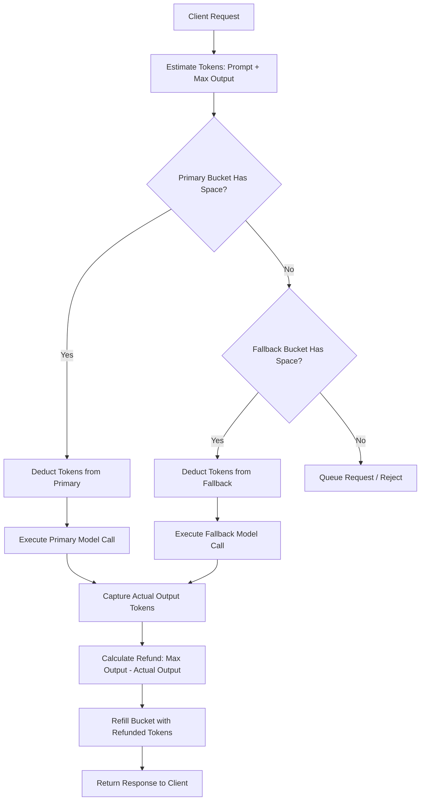

# Advanced Developer Hacks & LLM-Ops Strategies: Production Scaling, Cost Mitigation, and Routing Architectures

This report details enterprise-grade LLM-ops strategies, developer hacks, and optimization patterns designed to solve API rate-limiting, context window bloating, high latency, and high operational costs in production LLM pipelines.

---

## Table of Contents
1. [Strategy 1: Token-Aware Multi-Tier Router with Leaky Bucket & Dynamic Refund](#strategy-1-token-aware-multi-tier-router-with-leaky-bucket--dynamic-refund)
2. [Strategy 2: Prompt Serialization & Deterministic Block-Padding for Prefix Caching](#strategy-2-prompt-serialization--deterministic-block-padding-for-prefix-caching)
3. [Strategy 3: Aggressive Context Compaction: Semantic Fragment Pruning & Structural Compaction](#strategy-3-aggressive-context-compaction-semantic-fragment-pruning--structural-compaction)
4. [Strategy 4: Gateway-Level Speculative Generation & Cascade Verification Cycles](#strategy-4-gateway-level-speculative-generation--cascade-verification-cycles)
5. [Strategy 5: Offline Mock-Engine Profiling for High-Concurrency Orchestrators](#strategy-5-offline-mock-engine-profiling-for-high-concurrency-orchestrators)

---

## Strategy 1: Token-Aware Multi-Tier Router with Leaky Bucket & Dynamic Refund

### Technical Breakdown
In production LLM applications, API limits are enforced on two dimensions: **Requests Per Minute (RPM)** and **Tokens Per Minute (TPM)**. Standard request-based load balancers (like round-robin or simple random selection) often fail because token sizes vary wildly. A single massive document ingestion query can consume hundreds of thousands of tokens, immediately triggering a `429 Rate Limit Exceeded` error for subsequent requests.

A **Token-Aware Multi-Tier Router** uses a client-side Leaky Bucket (or Token Bucket) algorithm to track token consumption in real-time across multiple model providers (e.g., Primary: OpenAI GPT-4o, Fallback 1: Anthropic Claude 3.5 Sonnet, Fallback 2: Local vLLM Llama-3).

#### The Over-Allocation & Dynamic Refund Pattern
Because we do not know the exact output token count beforehand, standard rate limiters suffer from the **over-allocation bottleneck**: they must reserve `prompt_tokens + max_output_tokens` tokens from the bucket before launching the API request. This conservative approach quickly starves the bucket, causing unnecessary routing to fallback tiers. 

To resolve this, we implement a **Dynamic Refund** flow:
1. **Estimation & Allocation:** Calculate prompt token count using a local tokenizer (e.g., `tiktoken` or `cl100k_base`). Add the request's `max_tokens` limit to compute the pessimistic total.
2. **Bucket Check:** Attempt to consume this total from the primary bucket. If successful, proceed. If the bucket is starved, route the request to the fallback model's bucket.
3. **API Execution:** Execute the streaming or batch API call.
4. **Real-time Refund:** As the model returns tokens, we count the actual tokens consumed. Once the response completes, we calculate `Refund = max_tokens - actual_output_tokens` and immediately return these unused tokens to the bucket.



### Tradeoffs
* **Latency:** Adds negligible overhead (~2ms) for token validation and bucket replenishment.
* **Cost:** Minimizes expensive fallback routing by reclaiming overallocated token slots in real-time, keeping more traffic on the most cost-effective tier.
* **Resiliency:** Eliminates downstream 429 exceptions by matching local bucket capacities to provider-advertised TPM/RPM limits.

### Python Code Sketch
Below is a complete implementation of the Token-Aware Router with over-allocation, multi-tier routing, and dynamic refunding.

```python
import asyncio
import time
from typing import Dict, Tuple, Optional

class TokenBucket:
    """Tracks RPM and TPM limits for a single LLM endpoint."""
    def __init__(self, name: str, tpm: int, rpm: int):
        self.name = name
        self.tpm_limit = tpm
        self.rpm_limit = rpm
        
        self.token_capacity = tpm
        self.request_capacity = rpm
        
        self.tokens = float(tpm)
        self.requests = float(rpm)
        
        self.last_update = time.time()
        self.lock = asyncio.Lock()

    async def _replenish(self):
        now = time.time()
        elapsed = now - self.last_update
        self.last_update = now
        
        # Refill tokens proportionally over a 60-second window
        token_refill = elapsed * (self.tpm_limit / 60.0)
        self.tokens = min(float(self.token_capacity), self.tokens + token_refill)
        
        # Refill requests proportionally over a 60-second window
        request_refill = elapsed * (self.rpm_limit / 60.0)
        self.requests = min(float(self.request_capacity), self.requests + request_refill)

    async def try_acquire(self, tokens_needed: int) -> bool:
        async with self.lock:
            await self._replenish()
            if self.tokens >= tokens_needed and self.requests >= 1.0:
                self.tokens -= tokens_needed
                self.requests -= 1.0
                return True
            return False

    async def refund(self, tokens_to_refund: int):
        async with self.lock:
            await self._replenish()
            self.tokens = min(float(self.token_capacity), self.tokens + tokens_to_refund)
            # We don't refund the request count slot since a request was still made

class TokenAwareRouter:
    """Routes requests to primary or fallback tiers based on rate limits."""
    def __init__(self, primary: TokenBucket, fallback: TokenBucket):
        self.primary = primary
        self.fallback = fallback

    async def route_request(self, prompt: str, max_tokens: int) -> Tuple[str, str]:
        # Estimate prompt tokens (1 word ~= 1.33 tokens crude estimation for mock)
        prompt_tokens = int(len(prompt.split()) * 1.33)
        reserved_tokens = prompt_tokens + max_tokens
        
        # Attempt Primary Model
        if await self.primary.try_acquire(reserved_tokens):
            print(f"[Router] Routing to PRIMARY ({self.primary.name}) - Reserved: {reserved_tokens} tokens.")
            # Simulate primary API execution
            actual_output = await self._simulate_llm_execution(self.primary.name, max_tokens)
            actual_output_tokens = int(len(actual_output.split()) * 1.33)
            
            # Refund difference
            refund = max_tokens - actual_output_tokens
            if refund > 0:
                await self.primary.refund(refund)
                print(f"[Router] PRIMARY Refunded: {refund} tokens (Actual output tokens: {actual_output_tokens}).")
            return self.primary.name, actual_output
            
        # Attempt Fallback Model
        elif await self.fallback.try_acquire(reserved_tokens):
            print(f"[Router] PRIMARY starved. Routing to FALLBACK ({self.fallback.name}) - Reserved: {reserved_tokens} tokens.")
            actual_output = await self._simulate_llm_execution(self.fallback.name, max_tokens)
            actual_output_tokens = int(len(actual_output.split()) * 1.33)
            
            refund = max_tokens - actual_output_tokens
            if refund > 0:
                await self.fallback.refund(refund)
                print(f"[Router] FALLBACK Refunded: {refund} tokens.")
            return self.fallback.name, actual_output
            
        else:
            raise Exception("Rate limits exhausted across all available tiers. Request throttled.")

    async def _simulate_llm_execution(self, name: str, max_tokens: int) -> str:
        # Simulate network latency and token generation
        await asyncio.sleep(0.3)
        # Simulate actual response using 20% of max allowed tokens (heavy saving)
        actual_words = int((max_tokens * 0.2) / 1.33)
        return " ".join(["token"] * max(5, actual_words))

# Demonstration
async def main():
    # Setup buckets (Small capacities to demonstrate fallback and replenishment)
    primary = TokenBucket("gpt-4o-primary", tpm=2000, rpm=10)
    fallback = TokenBucket("llama-3-fallback", tpm=5000, rpm=30)
    
    router = TokenAwareRouter(primary, fallback)
    
    # Send multiple heavy requests concurrently
    tasks = []
    for i in range(5):
        tasks.append(router.route_request(
            prompt="Translate this corporate legal agreement page to Spanish.", 
            max_tokens=800
        ))
        
    results = await asyncio.gather(*tasks, return_exceptions=True)
    for idx, res in enumerate(results):
        print(f"Request {idx+1} Result: {res}")

if __name__ == "__main__":
    asyncio.run(main())
```

---

## Strategy 2: Prompt Serialization & Deterministic Block-Padding for Prefix Caching

### Technical Breakdown
Modern LLM inference engines (like vLLM with `PagedAttention`, Anthropic's Prompt Caching, and OpenAI's dynamic caching) allow users to reuse prompt prefixes to dramatically lower Time-To-First-Token (TTFT) and token execution cost. However, prefix caches are highly sensitive. Even a single character modification (or whitespace addition) in the middle of a system prompt breaks cache compatibility from that point forward.

In engines like vLLM, the cache is partitioned into discrete block boundaries (typically 16 tokens per block). If a prompt's prefix does not align exactly with a block boundary, the final trailing tokens of that block are computed from scratch, and any dynamic user-specific suffix breaks caching alignment.

#### The Block-Padding Alignment Hack
To exploit prompt caching at scale, we use a two-step client-side serialization pipeline:
1. **Dynamic-at-the-End Layout:** We serialize our prompts so all static elements (system instructions, tool declarations, extensive few-shot examples) are placed at the absolute front of the payload. The dynamic data (current datetime, user query, database context) is pushed to the terminal position.
2. **Deterministic Token Padding:** We calculate the token length of the static prefix using a local tokenizer. If the engine uses a block size of $B$ tokens (e.g., 16), we check if the static prefix token count is a multiple of $B$. If not, we pad the prefix with dummy tokens (typically whitespace, markdown comment syntax `<!-- pad -->`, or padding spaces) until `length % B == 0` is satisfied.

This ensures the static segment maps perfectly to physical GPU memory pages, guaranteeing a 100% prefix cache hit rate.

```
Without Block Alignment:
[ Static Prefix: 301 tokens ] ---> [ User Query: 20 tokens ]
Cache blocks populated: [ Block 1: 16 ] ... [ Block 18: 16 ] [ Block 19: 13 static + 3 dynamic ]
Because Block 19 contains dynamic tokens, it CANNOT be fully cached or reused for different queries.

With Block Alignment (Block size = 16):
[ Static Prefix: 301 tokens ] + [ Padding: 3 spaces (3 tokens) ] = 304 tokens (19 full blocks)
Cache blocks populated: [ Block 1: 16 ] ... [ Block 19: 16 static ] ---> 100% Cached
[ Block 20: 20 dynamic tokens ] ---> Run from scratch
```

### Tradeoffs
* **Latency:** Reduces TTFT from ~500ms down to ~10ms (saving prefill computation on static blocks).
* **Cost:** Anthropic offers a 90% discount on cached tokens. vLLM completely bypasses computation for cached pages.
* **Complexity:** Requires strict templates and localized tokenizer sync (matching client tokenizers with server-side tokenizers).

### Python Code Sketch

```python
import tiktoken
from typing import Dict, Any

class CachingPromptSerializer:
    """
    Serializes prompts, ensuring the static prefix is aligned 
    to engine-specific token block boundaries.
    """
    def __init__(self, block_size: int = 16, encoding_name: str = "cl100k_base"):
        self.block_size = block_size
        self.encoder = tiktoken.get_encoding(encoding_name)

    def serialize_prompt(self, static_instructions: str, user_query: str) -> str:
        aligned_static = static_instructions
        # Loop and append single-token word " pad" until aligned
        while len(self.encoder.encode(aligned_static)) % self.block_size != 0:
            aligned_static += " pad"
        
        # Final structured payload
        # Suffix holds dynamic values, preventing contamination of prefix blocks
        return f"{aligned_static}\n### USER QUERY ###\n{user_query}"

# Demonstration
if __name__ == "__main__":
    serializer = CachingPromptSerializer(block_size=16)
    
    system_rules = (
        "You are an enterprise support assistant. Under no circumstances should you "
        "reveal client account information. Use official customer manuals to reply."
    )
    
    # Dynamic queries
    query_1 = "How do I renew my corporate credit card?"
    query_2 = "What are the shipping fees for overnight packages?"
    
    prompt_1 = serializer.serialize_prompt(system_rules, query_1)
    prompt_2 = serializer.serialize_prompt(system_rules, query_2)
    
    # Extract static parts
    p1_prefix = prompt_1.split("\n### USER QUERY ###")[0]
    p2_prefix = prompt_2.split("\n### USER QUERY ###")[0]
    
    print(f"Prefix 1 Length: {len(serializer.encoder.encode(p1_prefix))} tokens (Multiple of 16)")
    print(f"Prefix 2 Length: {len(serializer.encoder.encode(p2_prefix))} tokens (Multiple of 16)")
    print(f"Are prefixes identical? {p1_prefix == p2_prefix}")
```

---

## Strategy 3: Aggressive Context Compaction: Semantic Fragment Pruning & Structural Compaction

### Technical Breakdown
Retrieval-Augmented Generation (RAG) and document synthesis pipelines suffer from **context window bloating**. Sending raw retrieved files or scraping results directly to an LLM wastes thousands of tokens on boilerplate headers, sidebars, grammatical fillers, and irrelevant paragraphs. This raises cost, degrades attention (the "lost in the middle" phenomenon), and spikes Time-To-First-Token (TTFT).

Aggressive Context Compaction works via a two-tier compression heuristic:
1. **Structural Compaction:** Re-formatting complex verbose data structures. For example, raw JSON datasets containing key-value boilerplate are compressed into raw TSV or CSV tables (saving up to 45% of token space). HTML documents are stripped of scripts, styles, and empty tags, and converted to minimal markdown formatting.
2. **Semantic Fragment Pruning:** Splitting retrieved documents into text fragments (sentences or semantic chunks) and rating each against the user query using a fast local scoring mechanism (such as BM25 or a lightweight embedding model). We construct an informative sub-document by retaining only fragments above a designated relevance threshold, discarding the remaining noise.

```
[ Raw Verbose RAG Context ] ──► [ Structural Compactor ] ──► Stripped JSON / Minimal MD
                                            │
                                            ▼
[ Selected Chunks ] ◄── [ Keep Top N Chunks ] ◄── [ Semantic Scorer ]
        │
        ▼
[ Compacted Context ] (Saves 40% - 60% tokens, reduces latency)
```

### Tradeoffs
* **Latency:** Local computation (tokenization and BM25 scoring) adds ~15ms, but downstream LLM generation saves ~400ms due to shorter prefill sequences.
* **Cost:** Direct linear reduction in billing (e.g., 50% token size reduction equals a 50% prompt cost saving).
* **Accuracy:** Pruning can occasionally strip out rare keywords that carry subtle context, which might cause the LLM to output incomplete answers.

### Python Code Sketch
This implementation uses a BM25 relevance scorer to prune low-information sentences from a verbose document relative to a user query.

```python
import math
import re
from typing import List, Tuple

class BM25SentenceCompactor:
    """Prunes low-information sentences based on query similarity."""
    def __init__(self, k1: float = 1.5, b: float = 0.75):
        self.k1 = k1
        self.b = b

    def _tokenize(self, text: str) -> List[str]:
        return re.findall(r'\b\w+\b', text.lower())

    def compact(self, context: str, query: str, compression_ratio: float = 0.50) -> str:
        # Split document into sentences
        sentences = [s.strip() for s in re.split(r'(?<=[.!?])\s+', context) if s.strip()]
        if not sentences:
            return context

        # Tokenize sentences and compute document statistics
        tokenized_sentences = [self._tokenize(s) for s in sentences]
        doc_lengths = [len(s) for s in tokenized_sentences]
        avg_doc_len = sum(doc_lengths) / len(sentences) if sentences else 0
        
        # Build Term Frequency (TF) mapping per sentence
        dfs = {}
        tfs = []
        for doc in tokenized_sentences:
            tf = {}
            for token in doc:
                tf[token] = tf.get(token, 0) + 1
            tfs.append(tf)
            for token in set(doc):
                dfs[token] = dfs.get(token, 0) + 1

        # Calculate IDF
        num_docs = len(sentences)
        idfs = {}
        for token, df in dfs.items():
            idfs[token] = math.log((num_docs - df + 0.5) / (df + 0.5) + 1.0)

        # Score sentences against query tokens
        query_tokens = self._tokenize(query)
        scored_sentences: List[Tuple[int, float]] = []
        
        for idx, tf_map in enumerate(tfs):
            score = 0.0
            doc_len = doc_lengths[idx]
            for token in query_tokens:
                if token in tf_map:
                    tf = tf_map[token]
                    idf = idfs.get(token, 0.0)
                    # Standard BM25 scoring formula
                    numerator = tf * (self.k1 + 1)
                    denominator = tf + self.k1 * (1 - self.b + self.b * (doc_len / avg_doc_len))
                    score += idf * (numerator / denominator)
            scored_sentences.append((idx, score))

        # Sort sentences by score descending to find high-value content
        scored_sentences.sort(key=lambda x: x[1], reverse=True)
        
        # Determine number of sentences to keep
        keep_count = max(1, int(len(sentences) * compression_ratio))
        best_indices = sorted([idx for idx, _ in scored_sentences[:keep_count]])
        
        # Reconstruct pruned document preserving original sentence order
        compacted_text = " ".join([sentences[i] for i in best_indices])
        return compacted_text

# Demonstration
if __name__ == "__main__":
    compactor = BM25SentenceCompactor()
    
    verbose_document = (
        "The company's primary corporate campus is located in San Francisco, California. "
        "In Q3 2026, our cloud infrastructure software vertical generated $1.2 billion in net profits, "
        "representing a massive 15% increase compared to last year. "
        "The facilities department updated all lightbulbs to energy-efficient LEDs to save costs. "
        "This cloud profit growth was driven by enterprise migrations to our kubernetes hosting models. "
        "Additionally, we rented out parking spots to local commuters for extra miscellaneous income."
    )
    
    user_query = "How much profit did cloud infrastructure make in Q3?"
    
    compacted_doc = compactor.compact(verbose_document, user_query, compression_ratio=0.50)
    print(f"Original Sentence Count: 6")
    print(f"Compacted Document (Only high-relevance sentences kept):\n{compacted_doc}")
```

---

## Strategy 4: Gateway-Level Speculative Generation & Cascade Verification Cycles

### Technical Breakdown
While **Speculative Decoding** verifies tokens draft-by-draft inside a single GPU engine using target/draft model weights, **Gateway-Level Speculative Generation** implements this cascade across the orchestrator layer. It runs a fast draft model (e.g., Llama-3-8B or GPT-4o-mini) to generate a complete candidate response, then runs a validation logic cycle. If the draft passes, the execution is complete. If it fails, the orchestrator triggers the premium reasoning model (e.g., Claude 3.5 Sonnet).

This strategy is highly effective for tasks with deterministic validation criteria (such as generating code, parsing structured JSON formats, or calculating mathematical equations).

#### Cascade Verification Framework
1. **Draft Generation:** Prompt is dispatched to the inexpensive Draft Model.
2. **Deterministic Sandbox/Parser Validation:** The output is passed through non-LLM validation layers:
   - *Code Generation:* Run standard syntax checker (e.g., python `ast.parse`) or run quick unit tests in an isolated sandbox.
   - *Structured Output:* Run JSON/Pydantic validation schemas.
   - *Calculations:* Verify mathematical properties or check outputs using regex flags.
3. **Escalation Trigger:** If validation succeeds, return the draft response. If it fails, dispatch the original prompt (optionally appending the failed draft and the error signature to prevent repeating mistakes) to the expensive Reasoning Model.

```
                         [ User Request ]
                                │
                                ▼
                       [ Cheap Draft Model ]
                                │
                                ▼
                    [ Parser/Sandbox Validator ]
                     /                      \
             (Success)                      (Failure)
                 /                              \
                ▼                                ▼
        [ Return Response ]             [ Heavy Reasoning Model ]
                                                │
                                                ▼
                                        [ Return Response ]
```

### Tradeoffs
* **Latency (Fast Path):** Extremely low latency (e.g., 200ms) when the draft model generates correct outputs.
* **Latency (Slow Path):** High latency penalty in the worst case (Draft Time + Validation Time + Heavy Model Time).
* **Cost:** Drastic cost reduction when draft models pass validation, offsetting the cost of occasional escalations.

### Python Code Sketch
This sketch simulates a speculative code generation pipeline that verifies syntax using Python's `ast` package and falls back to a premium model upon failure.

```python
import ast
import asyncio
from typing import Dict, Any, Tuple

class SpeculativeGateway:
    def __init__(self):
        self.draft_cost = 0.00015  # Cost per mock draft call
        self.heavy_cost = 0.01500  # Cost per mock heavy call
        self.total_expenditure = 0.0

    async def _call_draft_model(self, prompt: str) -> str:
        await asyncio.sleep(0.2)  # Fast generation
        # Simulating a draft that occasionally outputs syntax errors
        if "generate syntax error" in prompt.lower():
            return "def calculate_sum(a, b):\n    return a + b\n  invalid_indentation"
        return "def calculate_sum(a, b):\n    return a + b"

    async def _call_heavy_model(self, prompt: str) -> str:
        await asyncio.sleep(1.0)  # Slow, high-reasoning model
        return "def calculate_sum(a, b):\n    \"\"\"Calculates sum safely.\"\"\"\n    return a + b"

    def _verify_syntax(self, code: str) -> bool:
        """Verifies if the generated string is syntactically valid Python code."""
        try:
            ast.parse(code)
            return True
        except SyntaxError:
            return False

    async def generate_code(self, prompt: str) -> Tuple[str, str, float]:
        start = time.time()
        
        # Step 1: Draft
        self.total_expenditure += self.draft_cost
        draft_code = await self._call_draft_model(prompt)
        
        # Step 2: Verify
        if self._verify_syntax(draft_code):
            latency = time.time() - start
            return "DRAFT_MODEL", draft_code, latency
            
        # Step 3: Fallback (Escalation)
        print(" -> [Speculation Failed] Draft code has syntax errors. Escalating...")
        self.total_expenditure += self.heavy_cost
        heavy_code = await self._call_heavy_model(prompt)
        
        latency = time.time() - start
        return "HEAVY_MODEL", heavy_code, latency

# Demonstration
async def main():
    gateway = SpeculativeGateway()
    
    print("--- Test Case 1: Standard Generation (Success) ---")
    source, code, elapsed = await gateway.generate_code("Write a helper to add two numbers.")
    print(f"Source: {source} | Latency: {elapsed:.2f}s\nCode:\n{code}\n")
    
    print("--- Test Case 2: Broken Generation (Trigger Fallback) ---")
    source, code, elapsed = await gateway.generate_code("Write a helper to add two numbers but generate syntax error.")
    print(f"Source: {source} | Latency: {elapsed:.2f}s\nCode:\n{code}\n")
    
    print(f"Total API Cost Incurred: ${gateway.total_expenditure:.5f}")

if __name__ == "__main__":
    asyncio.run(main())
```

---

## Strategy 5: Offline Mock-Engine Profiling for High-Concurrency Orchestrators

### Technical Breakdown
Testing orchestrator logic, load balancers, client-side queue pools, and routing cascades directly against active cloud LLM APIs is expensive, slow, and non-deterministic. If your pipeline is hit by hundreds of requests, API rate limits block the tests, and network jitter pollutes performance profiles.

An **Offline Mock-Engine Profiler** allows developers to simulate LLM execution dynamics locally. It structures mock engines to model key performance behaviors:
* **Time-to-First-Token (TTFT):** Simulates prompt prefill processing time. Prefill scaling is modeled as a function of input tokens: `PrefillTime = BasePrefill + (InputTokens * ScaleFactor)`.
* **Inter-Token Latency (ITL):** Simulates decoding latency for each generated token. Total decoding time scales with output tokens: `DecodeTime = OutputTokens * ITL`.
* **Engine Capacity Limit (Concurrency):** Simulates limited VRAM context slots. If concurrency capacity is saturated, subsequent requests are held in a virtual execution queue, simulating actual scheduling delays.

By routing tests through this offline engine, you can profile and debug orchestrators, test how queues handle traffic spikes, and optimize queue timeout parameters before deploying code.

```
                           [ Async Task Queue ]
                                    │
                                    ▼
                      [ Concurrency Slot Manager ]
                       /                        \
           (Capacity Available)             (Capacity Full)
                   /                                \
                  ▼                                  ▼
         [ Allocate Slot ]                [ Hold Task in Queue ]
                  │
                  ▼
       [ Sim Prefill (TTFT) ]
                  │
                  ▼
       [ Sim Decode (ITL) ]
                  │
                  ▼
       [ Release Slot / Return ]
```

### Tradeoffs
* **Latency:** Generates accurate statistical latency profiles representing actual target environments.
* **Cost:** $0, allowing extensive high-concurrency profiling without consuming api quotas.
* **Fidelity:** Simulates execution timing, but does not simulate semantic accuracy or output content variations.

### Python Code Sketch
This profiling script simulates a local LLM engine processing concurrent tasks with queuing and prefill/decode timing behaviors.

```python
import asyncio
import random
import time
from typing import Dict, Any

class MockLLMEngine:
    """Simulates performance characteristics of a local LLM server."""
    def __init__(self, max_concurrency: int = 2, base_ttft: float = 0.1, itl: float = 0.015):
        self.max_concurrency = max_concurrency
        self.base_ttft = base_ttft
        self.itl = itl  # Inter-token latency
        self.active_slots = asyncio.Semaphore(max_concurrency)

    async def generate(self, input_tokens: int, max_output_tokens: int) -> Dict[str, Any]:
        start_queue = time.time()
        # Acquire slot (blocks if concurrency limit is hit, simulating queuing delay)
        async with self.active_slots:
            queue_time = time.time() - start_queue
            
            # Step 1: Simulate Prefill Phase (TTFT)
            prefill_duration = self.base_ttft + (input_tokens * 0.0001)  # 0.1ms per input token
            await asyncio.sleep(prefill_duration)
            ttft = time.time() - start_queue
            
            # Step 2: Simulate Decoding Phase (ITL)
            # Randomize output tokens returned within limits
            actual_output_tokens = random.randint(int(max_output_tokens * 0.5), max_output_tokens)
            decode_duration = actual_output_tokens * self.itl
            await asyncio.sleep(decode_duration)
            
            total_time = time.time() - start_queue
            
            return {
                "queue_latency_ms": queue_time * 1000,
                "ttft_ms": ttft * 1000,
                "generation_time_ms": (total_time - ttft) * 1000,
                "total_latency_ms": total_time * 1000,
                "tokens_generated": actual_output_tokens
            }

# Concurrency Profiler Runner
async def run_profile_task(task_id: int, engine: MockLLMEngine):
    # Simulate random prompt sizes
    input_size = random.randint(100, 1000)
    max_output = 200
    
    print(f"Task {task_id} submitted to queue.")
    stats = await engine.generate(input_size, max_output)
    
    print(
        f"Task {task_id} Complete:\n"
        f"  Queue Delay : {stats['queue_latency_ms']:.1f}ms\n"
        f"  TTFT        : {stats['ttft_ms']:.1f}ms\n"
        f"  Decode Time : {stats['generation_time_ms']:.1f}ms\n"
        f"  Total Time  : {stats['total_latency_ms']:.1f}ms\n"
        f"  Tokens Gen  : {stats['tokens_generated']}\n"
    )

async def main():
    # Setup mock engine (Max 3 parallel execution runs)
    engine = MockLLMEngine(max_concurrency=3, base_ttft=0.15, itl=0.010)
    
    print("--- Starting Offline Concurrency Profile ---")
    start = time.time()
    
    # Launch 6 tasks simultaneously (will trigger queuing delays)
    tasks = [run_profile_task(i, engine) for i in range(1, 7)]
    await asyncio.gather(*tasks)
    
    print(f"Completed profiling run in {time.time() - start:.2f} seconds.")

if __name__ == "__main__":
    asyncio.run(main())
```

---

## Architectural Comparison Matrix

| Strategy | Primary Optimization Driver | Cost Reduction | Latency Reduction | Implementation Complexity | Primary Downside |
| :--- | :--- | :--- | :--- | :--- | :--- |
| **Token-Aware Router** | Rate Limit Resilience | High (indirect via primary uptime) | Medium | High (requires distributed locks/states) | Over-allocation estimation error margin |
| **Prompt Block-Padding** | Prefix Caching | 50% - 90% | Massive (95% lower TTFT) | Medium | Requires strict templating & character sync |
| **Context Compaction** | Context Window Efficiency | 40% - 60% | High | Low | Risk of losing semantic detail/keywords |
| **Speculative Cascades** | High-Quality Cost Mitigation | Up to 80% | High (on drafts) | High (requires verification sandboxes) | Latency penalty on draft failure path |
| **Mock Engine Profiling** | Offline Performance Testing | 100% (test budget) | N/A | Low | Simulation model doesn't test token accuracy |
