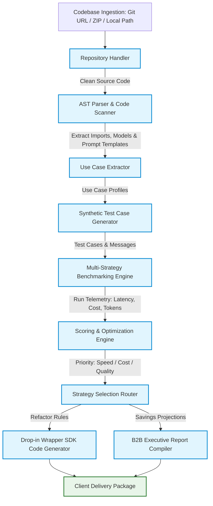
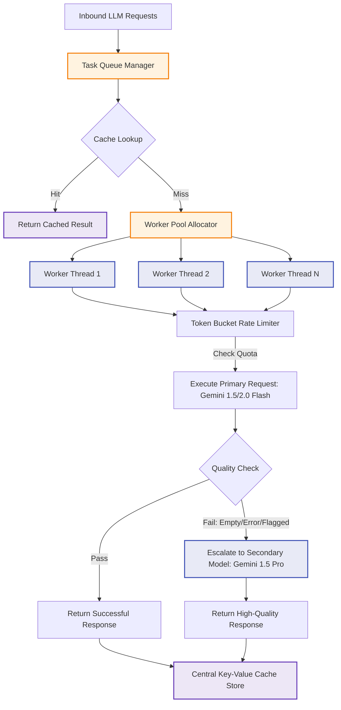

# UnDocumented: System Architecture Diagrams

This document details the software architecture, parallel execution queue mechanisms, and Google Cloud deployment model of the **UnDocumented** optimization platform.

---

## 1. End-to-End Pipeline Data Flow

The following diagram maps the step-by-step lifecycle of a codebase as it enters the UnDocumented pipeline, gets analyzed, and exits as a validated, optimized package.



### Data Flow Descriptions:
1.  **Codebase Ingestion**: The system pulls code repositories from Git (supporting secure SSH/HTTPS tokens), extracts uploaded ZIP archives, or mounts a local directory.
2.  **AST Parser & Code Scanner**: Analyzes code files at the syntax level to map out all library imports and client configurations (`openai.OpenAI()`, `anthropic.Anthropic()`, etc.).
3.  **Synthetic Test Case Generator**: Generates realistic input prompts based on the extracted structure to feed the benchmarking engine.
4.  **Multi-Strategy Benchmarking Engine**: Simulates client workloads across all six optimization strategies simultaneously.
5.  **Scoring & Optimization Engine**: Computes weighted efficiency rankings using real token prices and latency metrics.
6.  **Code Generator & Report Compiler**: Automatically writes optimized wrappers (implementing retry logic, rate limiters, caching, and batching) and exports actionable Markdown/JSON reports.

---

## 2. Parallel Worker Pool Queue & Cascading Mechanism

The diagram below details the internal queuing, token bucket rate-limiting, key-value caching, and fallback escalation (cascading) mechanism of the **Distributed Worker Pool** and **Hybrid Cascading** strategies.



### Queue Execution Mechanics:
*   **Central Key-Value Cache Store**: Prevents redundant inference. If an identical prompt is sent, the request is served in sub-milliseconds without calling the API.
*   **Token Bucket Rate Limiter**: Actively throttles outgoing worker requests dynamically to comply with provider RPM (Requests Per Minute) and TPM (Tokens Per Minute) limiters, preventing `429 Too Many Requests` exceptions.
*   **Fast-to-Pro Model Cascading**: Workers first execute requests against the fast, inexpensive **Gemini 1.5/2.0 Flash**. The output is scanned for errors or low semantic quality. If a check fails, the request is dynamically routed to **Gemini 1.5 Pro** as an escalator.

---

## 3. Google Cloud Deployment Architecture

UnDocumented is built to run natively on Google Cloud Platform (GCP). The following diagram outlines the cloud architecture hosting the system.

```mermaid
graph LR
    %% Define styles
    classDef client fill:#eceff1,stroke:#607d8b,stroke-width:2px;
    classDef gcp fill:#e0f2f1,stroke:#00b0ff,stroke-width:3px;
    classDef external fill:#ffebee,stroke:#c62828,stroke-width:2px;

    User[User / CI/CD Pipeline]:::client -->|HTTPS Trigger| APIGateway[Cloud Endpoints / API Gateway]:::gcp
    GeminiEnt[Gemini Enterprise Workspace]:::client -->|Model Context Protocol (MCP)| CloudRunOrch[Cloud Run Orchestrator]:::gcp
    
    subgraph GCP Environment
        APIGateway -->|Ingress Route| CloudRunOrch
        CloudRunOrch -->|Read/Write Artifacts| GCSBucket[(Google Cloud Storage)]:::gcp
        
        CloudRunOrch -->|Parallel Task Allocation| CloudRunWorkers[Cloud Run Worker Pool]:::gcp
        CloudRunWorkers -->|Cache Sync| RedisCache[(Cloud Memorystore Redis)]:::gcp
    end
    
    CloudRunWorkers -->|Gemini API| GeminiAPI[Google AI Studio: Gemini 1.5/2.0 Flash/Pro]:::gcp
    CloudRunWorkers -->|External Call| OpenAI[OpenAI API Endpoint]:::external
    CloudRunWorkers -->|External Call| Anthropic[Anthropic API Endpoint]:::external
```

### Infrastructure Components:
*   **API Gateway / Cloud Endpoints**: Acts as the secure entrance interface for developers and automated CI/CD integration pipelines (e.g. GitHub Actions).
*   **Cloud Run Orchestrator**: Runs the core web service, analyzing user requests, fetching codebases, and coordinating tasks.
*   **Cloud Run Worker Pool**: An autoscaling pool of serverless containers that executes concurrent benchmarking tasks, processing code repositories and running parallel strategy tests.
*   **Cloud Memorystore (Redis)**: Operates as the high-speed, distributed cache shared across all Cloud Run worker containers.
*   **Google Cloud Storage (GCS)**: Stores raw input files, ZIP archives, configuration templates, and final optimized output packages.
*   **Google AI Studio / Gemini API (Gemini 1.5/2.0 Flash/Pro)**: API infrastructure providing high-throughput models for codebase reasoning and benchmarking.
*   **Model Context Protocol (MCP) Server**: Exposes standard code-analysis and optimization tools to the **Gemini Enterprise** client application, enabling secure, real-time repository assessments directly from the user's workspace.
